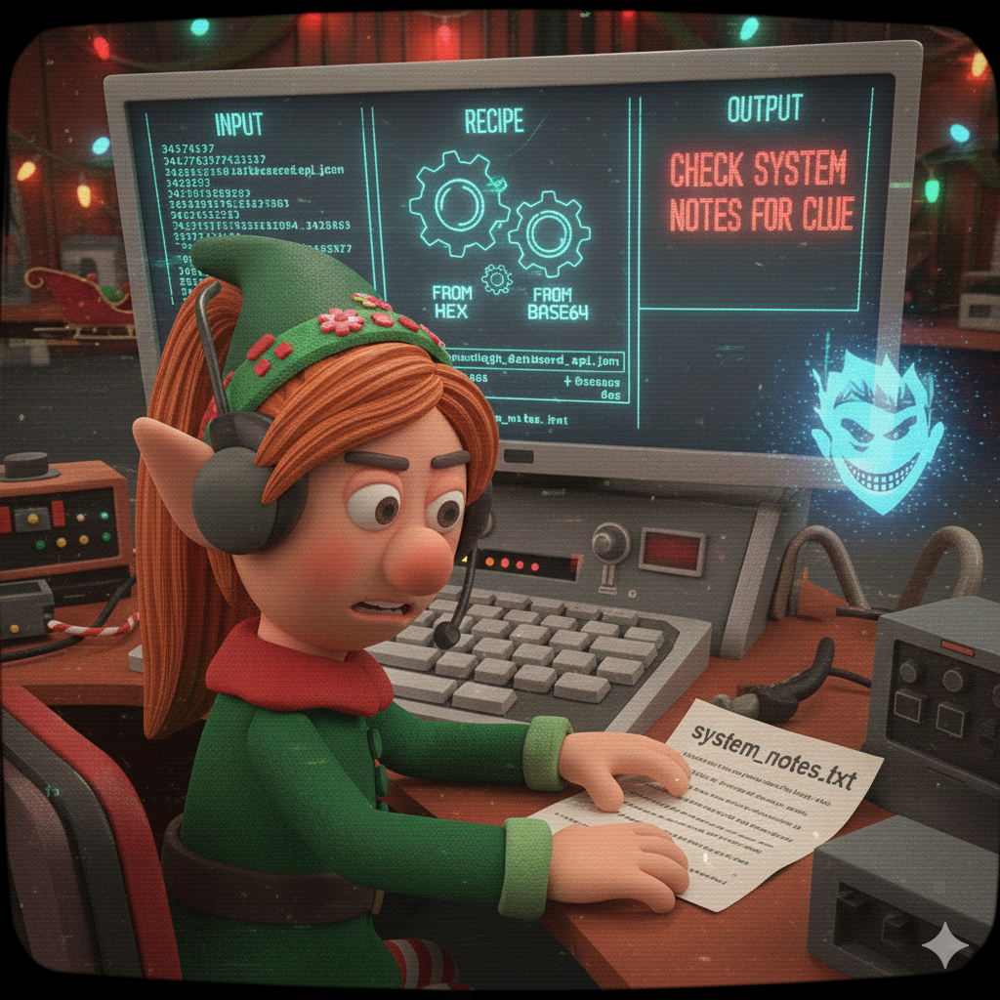

[← Main README](../README.md) | **Day 1** | [Next Day →](../day02/README.md)

---



# 🎄 Day 1 (December 12) - Sleigh Dashboard Sabotage

## 🎅 The Story

**December 12, 2024 - 09:15 AM (North Pole Time)**

Merry Tinselcode sits at her desk in the North Pole Operations Center (NPOC), surrounded by twinkling Christmas lights and the gentle hum of servers keeping Santa's infrastructure running. Outside the frosted windows, snow falls softly on the workshop where elves bustle about preparing toys.

She takes a sip of her peppermint cocoa and pulls up the **Sleigh Status Dashboard** - the central monitoring system that tracks the sleigh's readiness for Christmas Eve. Everything should read "All Systems Go" with green checkmarks.

Instead, she sees gibberish.

"That's... odd," Merry mutters, leaning closer to her screen. Where the status update should be, there's a string of random characters: `34376337...`

"Maybe the display's glitching?" She refreshes. The weird text remains.

Merry's elf instincts tingle. In her five years protecting North Pole systems, she's learned to trust her gut. Public-facing dashboards don't just randomly break. And this "gibberish" has a pattern to it. Almost like... **encoding**?

She pulls up the historical logs. Yesterday's status: perfectly normal. The day before: normal. But starting at **11:47 PM last night**, something changed.

"Someone's been messing with our dashboard," she realizes, her heart racing. "But why? And what are they trying to hide?"

Time to investigate. Christmas is only 13 days away, and Merry has a sneaking suspicion this is just the beginning...

---

## 🛠️ Prerequisites & Setup

**Welcome to Day 1!** This is your introduction to cybersecurity tools. We'll use **CyberChef** - a beginner-friendly web tool.

### Tools You'll Need

**CyberChef (Required)**
- **What it is:** Free web-based tool for encoding/decoding
- **Where:** https://gchq.github.io/CyberChef/
- **Installation:** None needed - it runs in your browser!
- **Works on:** Any device with a web browser (Windows, Mac, Linux, tablets)

### Getting Started Checklist

Before you begin:
- [ ] Open https://gchq.github.io/CyberChef/ in your browser
- [ ] Bookmark it for future days (you'll use it often!)
- [ ] Extract the `day01/artifacts/` folder (no password needed for Day 1)
- [ ] Have a text editor ready (Notepad, VSCode, or any editor)

**Estimated setup time:** 1 minute (just open the website!)

### Quick CyberChef Tutorial

**How CyberChef Works (3-step process):**

1. **Input (left side):** Paste the encoded text here
2. **Recipe (middle):** Drag operations like "From Hex" or "From Base64" here
3. **Output (right side):** See the decoded result automatically!

**Example - Decoding Hex:**
```
Input:  48656c6c6f
Recipe: "From Hex"
Output: Hello
```

**Finding Operations:**
- Use the search box on the left: type "hex", "base64", "rot13", etc.
- Drag the operation into the Recipe area
- Result appears automatically!

**You'll learn more in the lesson, but this gets you started!**

---

## 📚 Lesson: Learn the Technique

**Before starting this challenge, read the lesson:**
📖 [Encoding & Decoding - What, Why, and How](./lesson_encoding.md)

This lesson covers:
- What encoding is and why attackers use it
- Common encoding schemes (hex, base64, ROT13)
- How to recognize encoding patterns
- Tools for decoding (CyberChef, PowerShell)
- Multi-layer encoding techniques

**New to encoding?** Start with the lesson - it assumes zero prior knowledge and teaches you everything step-by-step!

---

## 🎯 The Challenge

You are **Merry Tinselcode**, Senior Security Elf. Your mission:

1. Investigate the suspicious Sleigh Status Dashboard message
2. Decode the hidden layers of encoding
3. Discover what Jack Frost is trying to tell you
4. Find the flag to prove you've uncovered the sabotage

**This is a multi-step investigation.** The message has been encoded multiple times to hide its meaning. You'll need to decode each layer carefully.

---

## 🔍 Artifacts

In the `artifacts/` folder you'll find:

- `sleigh_dashboard_api.json` - The current API response with the encoded message
- `dashboard_history.txt` - Previous dashboard responses (for comparison)
- `system_notes.txt` - Additional clues left in the system

**Start by examining the JSON file to see what Merry discovered!**

---

## 🎁 Your Mission

**Decode the hidden message and find the flag.**

The flag format is: `FROST{...}`

### 💡 Hints

<details>
<summary>Hint 1: What kind of encoding is this?</summary>

The message in `sleigh_dashboard_api.json` looks like hexadecimal (numbers 0-9 and letters a-f only). Try decoding from hex first!

Tools: CyberChef's "From Hex" operation, or PowerShell

</details>

<details>
<summary>Hint 2: It's not done yet!</summary>

After decoding from hex, you'll see another encoded string - this time it looks like base64 (ends with `=` or `==`).

Decode that layer too using "From Base64" in CyberChef or PowerShell.

</details>

<details>
<summary>Hint 3: Check the system notes</summary>

The decoded message will mention another file. Look in `system_notes.txt` for additional encoded data.

</details>

<details>
<summary>Hint 4: One more layer!</summary>

The data in `system_notes.txt` uses ROT13 encoding (Caesar cipher that shifts letters by 13).

In CyberChef, use the "ROT13" operation. Or online: https://rot13.com/

</details>

<details>
<summary>Hint 5: Multi-step summary</summary>

Complete path:
1. Decode `sleigh_dashboard_api.json` message: Hex → Base64 → Message mentioning system_notes.txt
2. Decode `system_notes.txt`: ROT13 → Reveals the flag!

</details>

---

## 🤔 Questions to Consider

As you solve this challenge, think about:

1. Why would an attacker use multiple layers of encoding?
2. What does modifying a public dashboard tell us about their access level?
3. How could the North Pole detect this kind of tampering automatically?
4. What should Merry's next steps be after finding this message?

---

## ➡️ Next Steps

Once you've found the flag, use it to unlock **Day 2's** artifacts:

1. Navigate to `../day02/`
2. Find `day02_artifacts.zip`
3. Use your Day 1 flag (including `FROST{}`) as the password
4. Continue the investigation...

The Nice List backup has been exposed. Merry needs your help again! 🎄

---

**Difficulty:** Easy (Warm-up)
**Estimated Time:** 15-20 minutes
**Skills:** Encoding recognition, multi-layer decoding, pattern analysis
**Tools Needed:** CyberChef (web-based) or PowerShell
