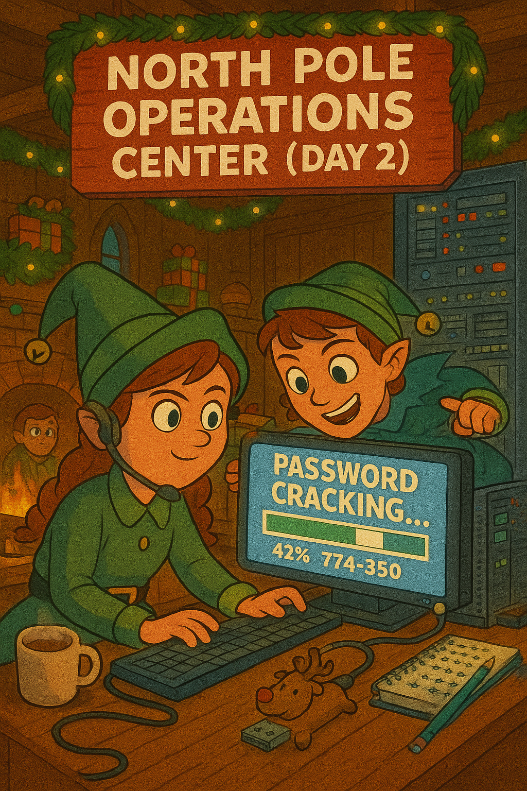

[← Previous Day](../day01/README.md) | [Main README](../README.md) | **Day 2** | [Next Day →](../day03/README.md)

---



# 🎄 Day 2 (December 13) - Nice List Backup Breach

## 🎅 The Story

**December 13, 2024 - 10:30 AM (North Pole Time)**

Aisha Frostwhisper nervously adjusts her elf hat as she stares at her screen. It's only her second week working in the North Pole Security Operations Center, and yesterday's dashboard incident already has everyone on edge.

"Hey Aisha," Merry calls over from her desk, tinsel garland draped over her monitor. "Can you check the cloud storage logs? I want to see if Jack Frost accessed anything else besides the dashboard."

"On it!" Aisha pulls up the North Pole Cloud Storage (NPCS) access logs, her fingers flying across the keyboard. She's eager to prove herself.

As she scrolls through the logs, something catches her eye. An S3 bucket labeled `nice-list-legacy-backups-2023` has been accessed multiple times over the past week. From an external IP address.

"Um... Merry?" Aisha's voice trembles slightly. "I found something."

Merry wheels her chair over. "What've you got?"

"This storage bucket... it's supposed to be private, but someone's been downloading files. Multiple times. Starting December 5th." Aisha clicks through. "It contains old password hashes from the legacy Nice List authentication system we decommissioned last year."

Merry's eyes widen. "Please tell me those accounts don't still exist in our current system."

Aisha pulls up the active elf accounts database. Her heart sinks. "Some of them do. And... Merry, according to the migration docs, when we upgraded systems, not everyone changed their passwords."

"Meaning if someone cracks those old hashes..." Merry doesn't finish the sentence.

"They could log in as those elves. Right now. Today." Aisha's hands are shaking. "What do we do?"

Merry takes a deep breath, grabbing her peppermint cocoa for courage. "We figure out which accounts are compromised before Jack Frost can use them. Download those backup files. We need to crack those hashes ourselves - see what he sees."

Dekker Frostbeard, the SOC Manager, leans out of his office. His magnificent beard sparkles with frost. "What's the situation?"

"Exposed backups with password hashes," Merry reports. "Possibly compromised elf accounts."

Dekker's expression hardens. "Christmas is 12 days away. We don't have time for a full password reset across all systems. Find out which specific accounts are at risk. Now."

Aisha nods, downloading the backup files. The race is on.

---

## 🛠️ Prerequisites & Setup

**This is your first time using password cracking tools!** Don't worry - we'll guide you through installation and basic usage.

### Tools You'll Need

You need **ONE** of these password cracking tools (beginners: choose John the Ripper):

**Option 1: John the Ripper (Recommended for beginners)**
- **What it is:** Popular, beginner-friendly password cracker
- **Windows:** Download from https://www.openwall.com/john/
  - Download "Windows binaries" ZIP
  - Extract to `C:\john` or your preferred location
  - Run from command prompt: `john.exe`
- **Linux:** `sudo apt install john`
- **Mac:** `brew install john`
- **Why John?** Simpler syntax, good documentation, great for learning

**Option 2: Hashcat (Advanced, faster)**
- **What it is:** GPU-accelerated password cracker (much faster with graphics card)
- **Windows:** Download from https://hashcat.net/hashcat/
- **Linux:** `sudo apt install hashcat`
- **Mac:** `brew install hashcat`
- **Why Hashcat?** Extremely fast, especially with GPU, used by professionals

### Additional Tools

You'll also use:
- **CyberChef** (from Day 1) - For decoding base64 hints
- **Text editor** - For creating custom wordlists

### Getting Started Checklist

Before you begin:
- [ ] Extract `day02_artifacts.zip` using Day 1's flag as password
- [ ] Install John the Ripper OR Hashcat (pick one!)
- [ ] Verify installation:
  - **John:** Open terminal/cmd and run `john --version`
  - **Hashcat:** Run `hashcat --version`
- [ ] Have CyberChef open in browser (you'll need it!)

**Estimated setup time:** 5-10 minutes (including download and installation)

### Quick John the Ripper Tutorial

**Basic Command Structure:**
```bash
john --format=<hash-type> --wordlist=<wordlist-file> <hash-file>
```

**Example - Cracking MD5 hashes:**
```bash
john --format=Raw-MD5 --wordlist=rockyou.txt hashes.txt
```

**Common Hash Formats:**
- `Raw-MD5` - MD5 hashes
- `Raw-SHA1` - SHA1 hashes
- `Raw-SHA256` - SHA-256 hashes

**Viewing Cracked Passwords:**
```bash
john --show <hash-file>
```

**You'll learn more in the lesson, including creating custom wordlists!**

---

## 📚 Lesson: Learn the Technique

**Before starting this challenge, read the lesson:**
📖 [Password Hashing & Cracking - What, Why, and How](./lesson_password_cracking.md)

This lesson covers:
- What password hashes are and how they work
- Different hash types (MD5, SHA1, SHA-256)
- How attackers crack password hashes
- Using hashcat and John the Ripper
- Creating custom wordlists for targeted attacks
- Why this matters for security professionals

**New to password cracking?** Start with the lesson - it's written for complete beginners!

---

## 🎯 The Challenge

You are **Aisha Snowsparkle**, Junior Security Elf. Your mission:

1. Examine the exposed Nice List backup files
2. Identify which type of password hashes are used
3. **Use your Day 1 skills** to decode hints in the password policy file
4. Create a custom wordlist based on North Pole password patterns
5. Crack the password hashes
6. Cross-reference with active elf accounts
7. Find the compromised admin account
8. Extract the flag from your findings

**This requires multiple steps and uses skills from Day 1!** You'll need to decode some base64 along the way.

---

## 🔍 Artifacts

**Password required:** Use Day 1's flag to extract `day02_artifacts.zip`

In the `artifacts/` folder you'll find:

- `nice_list_backup.txt` - Old password hashes from the legacy system
- `active_elf_accounts.txt` - Current North Pole employee accounts
- `password_policy.txt` - Old password requirements (contains encoded hints!)
- `base_wordlist.txt` - Starting wordlist with common passwords
- `cracking_guide.txt` - Tool installation and usage tips
- `admin_vault.zip` - 🔒 Password-protected archive with classified documents

**Start by examining the backup file and password policy!**

---

## 🎁 Your Mission

**Crack the password hashes and unlock the admin vault to get the flag.**

**Steps:**
1. Crack the password hash for the `admin_nicelist` account in `nice_list_backup.txt`
2. Use that cracked password to unlock `admin_vault.zip`
3. Read `security_memo.txt` inside the vault to get the flag

### 💡 Hints

<details>
<summary>Hint 1: Identifying hash types</summary>

Look at the length of the hashes in `nice_list_backup.txt`:
- 32 characters = MD5
- 40 characters = SHA1

You can identify them just by counting!

</details>

<details>
<summary>Hint 2: Decode the password policy (Day 1 skills!)</summary>

The password policy file has a base64-encoded note at the bottom. Use your Day 1 decoding skills!

It reveals the North Pole password pattern that elves used to use.

</details>

<details>
<summary>Hint 3: Read the Security Audit Note!</summary>

The password_policy.txt file has a SECURITY AUDIT NOTE about the admin_nicelist account.

Read it carefully! It tells you:
- The password format (FROST{...})
- What the password is about (weak hashing, password cracking)
- How it's written (l33tspeak)

This gives you enough information to create custom wordlist variations!

</details>

<details>
<summary>Hint 4: Creating a custom wordlist with FROST{} variations</summary>

Based on the security audit note, the admin password:
- Uses FROST{} format
- Is about "weak hashes get cracked"
- Written in l33tspeak (3 instead of e, @ instead of a, etc.)

Create a file `custom_wordlist.txt` with variations using the theme from the security note. Use l33tspeak substitutions:
```
(Start with the phrase from the security note)
(Add variations with different l33tspeak: a→@, e→3, s→$, o→0, i→1)
(Include underscores between words)
(Wrap each variation in FROST{...} format)
```

Try different substitutions: a→@, e→3, s→$, o→0, i→1, etc.

</details>

<details>
<summary>Hint 5: Using hashcat or John with your custom wordlist</summary>

**John the Ripper (Recommended):**
```bash
john --format=Raw-MD5 --wordlist=custom_wordlist.txt nice_list_backup.txt
john --show nice_list_backup.txt
```

**Hashcat:**
```bash
hashcat -m 0 -a 0 nice_list_backup.txt custom_wordlist.txt
```

Use YOUR custom wordlist with FROST{} variations, not base_wordlist.txt!

</details>

<details>
<summary>Hint 6: Finding the admin account</summary>

After cracking the hashes:
1. Look at which accounts were cracked
2. Check `active_elf_accounts.txt` to see which ones still exist
3. Find the one with "admin" or "backup" privileges
4. That account's password IS the flag!

</details>

---

## 🤔 Questions to Consider

As you solve this challenge, think about:

1. Why is it dangerous to keep old backup files in cloud storage?
2. Why didn't the North Pole force everyone to change passwords during the migration?
3. How does using a predictable password pattern make cracking easier?
4. What should the North Pole do immediately after identifying compromised accounts?
5. How does this connect to Day 1's dashboard compromise?

---

## ➡️ Next Steps

Once you've found the flag (the admin's cracked password), use it to unlock **Day 3's** artifacts:

1. Navigate to `../day03/`
2. Find `day03_artifacts.zip`
3. Use your Day 2 flag (including `FROST{}`) as the password
4. Continue helping the elves...

Someone's trying to brute force the Workshop Portal. Merry needs you! 🎄

---

**Difficulty:** Easy-Medium
**Estimated Time:** 25-35 minutes
**Skills:** Hash identification, password cracking, custom wordlist creation, data correlation
**Tools Needed:** Hashcat or John the Ripper (installation guide provided), CyberChef for base64
**Uses Day 1 Skills:** Base64 decoding ✅
