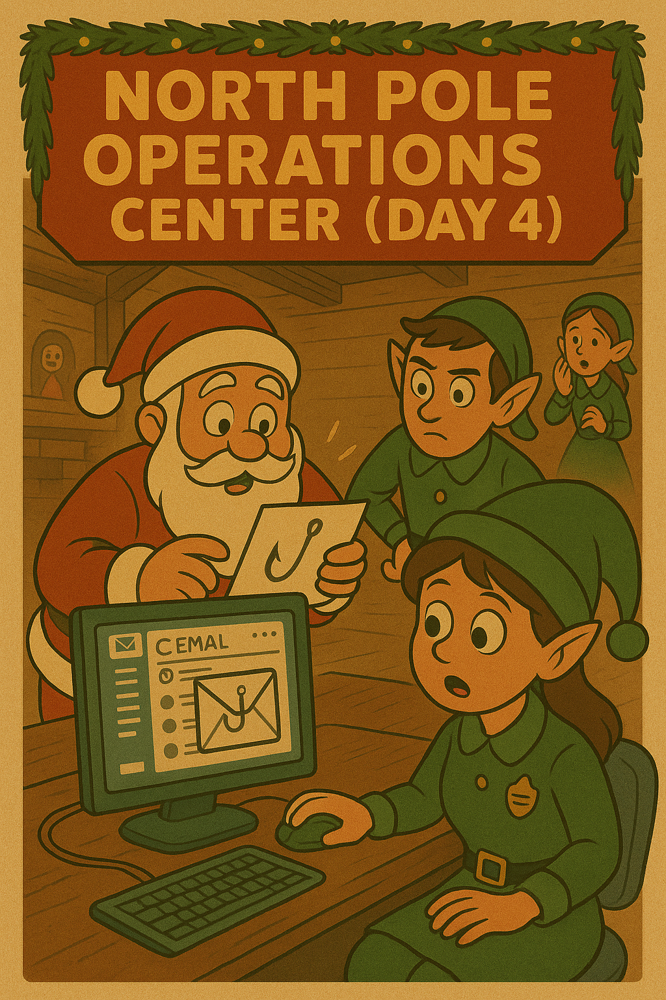

[← Previous Day](../day03/README.md) | [Main README](../README.md) | **Day 4** | [Next Day →](../day05/README.md)

---



# 🎄 Day 4 (December 15) - The Holiday Phishing Campaign

## 🎅 The Story

**December 15, 2024 - 08:45 AM (North Pole Time)**

Tom Icicle, the North Pole's Incident Response Lead, hasn't slept much after yesterday's brute force attack. His holly-patterned tie is slightly askew as he nurses his fourth cup of coffee, reviewing the security hardening checklist Dekker sent over at 4 AM.

His inbox chimes. Then chimes again. And again.

"What now?" Tom mutters, clicking open his email.

**Subject: URGENT - Suspicious emails to elves**
**From: Ginger Nutmeg, HR Director**

*Tom,*

*I've had seven elves forward me this email in the last hour. They're claiming it's about holiday bonuses, but our bonus notifications aren't sent until December 20th, and they NEVER come from external emails. I smell something fishy - or should I say, phishy?*

*Two elves already clicked the link before I could warn them. Can you investigate ASAP?*

*- Ginger*

Attached is a forwarded email with the subject: **"Your 2024 Holiday Bonus Has Been Approved! 🎁"**

Tom's jaw clenches. "Of course. Jack Frost got admin access yesterday and now he's already pivoting." He forwards the email to Merry and Aisha.

Three minutes later, his desk phone rings. It's Merry.

"Tom, I'm looking at this phishing email. It's... sophisticated," Merry says, her usual cheerful tone replaced with concern. "The branding looks perfect. North Pole logo, correct color scheme, even the footer matches our legitimate emails."

"But?" Tom prompts.

"But the email headers don't match. The 'From' address says bonus-notifications@northpole-global.com, but that domain doesn't exist in our DNS records. And Tom, the HTML source code... there's JavaScript in here that's been deliberately obfuscated."

Tom pulls up his own copy of the email in his forensics workstation, viewing the raw .eml file. Merry's right. The HTML is littered with encoded strings and character substitution. The "Click Here to View Your Bonus Details" button isn't just a simple link - it's dynamically constructed by JavaScript.

"Whoever made this knows what they're doing," Tom says grimly. "This isn't some script kiddie copying a phishing template. This is a targeted campaign against our elves."

Aisha's voice crackles over the speakerphone. "Tom, Merry - I just checked our workshop access logs. The two elves who clicked that link? Their credentials were used to access the Gift Production Database at 8:32 AM. From an external IP. The same IP range from yesterday's attack."

Tom feels his stomach drop. "Jack Frost is harvesting credentials. He got one admin account yesterday, now he wants more. We need to tear this phishing email apart. Find out where it's hosted, what kit he's using, and how he's tracking victims."

"On it," Merry responds, already diving into the email headers. "Tom, I'm forwarding you the .eml file and one of our legitimate bonus notification emails for comparison. We need to document every indicator so we can train the elves."

"Good thinking. And Merry?" Tom leans back in his chair, staring at the ceiling tiles decorated with snowflakes. "We need to move fast. If he's already compromised two more accounts, who knows what else he's planning."

Outside, the morning sun glints off freshly fallen snow. But in the North Pole Operations Center, the elves are battling a very different kind of winter storm.

---

## 📚 Lesson: Learn the Technique

**Before starting this challenge, read the lesson:**
📖 [Phishing Email Analysis - What, Why, and How](./lesson_phishing_analysis.md)

This lesson covers:
- What phishing is and why attackers use it (90%+ of breaches start here!)
- How to analyze email headers to detect spoofing
- Understanding HTML and JavaScript obfuscation in emails
- URL analysis and deobfuscation techniques
- How to identify phishing kits and their signatures
- Real-world defensive strategies

**New to email security?** Start with the lesson - it assumes zero prior knowledge!

---

## 🎯 The Challenge

You are **Merry Tinselcode**, Senior Security Elf. Your mission is to analyze the phishing email targeting North Pole elves:

1. Examine the raw phishing email file (holiday_bonus.eml)
2. **Use your Day 1 skills** - You'll need to decode base64-encoded data
3. **Use your Day 2 skills** - Compare the phishing email with a legitimate one to spot differences
4. **Use your Day 3 skills** - Check if the attacker's IP looks familiar
5. Analyze email headers to identify spoofing
6. Find the obfuscated phishing URL in the JavaScript
7. Decode the tracking parameters
8. Identify the phishing kit being used
9. Find the flag hidden in the HTML source

**This is a multi-step investigation that uses skills from Days 1, 2, and 3!**

---

## 🔍 Artifacts

**Password required:** Use Day 3's flag to extract `day04_artifacts.zip`

In the `artifacts/` folder you'll find:

- `holiday_bonus.eml` - The phishing email forwarded by HR (main challenge file)
- `legitimate_email.eml` - A real North Pole email for comparison
- `email_analysis_guide.txt` - Tips for analyzing emails on Windows (PowerShell commands, tools, etc.)

---

## 🎁 Your Mission

**Analyze the phishing email and find the flag.**

The flag is hidden in obfuscated JavaScript code within the HTML source. You'll need to:
- Identify email spoofing in the headers
- Find the JavaScript `<script>` tag with obfuscated code
- Deobfuscate the JavaScript variable that assembles the flag (using hex conversion, XOR decoding, and string reversal)
- Concatenate all the parts to reveal the complete flag

### 💡 Hints

<details>
<summary>Hint 1: Where to start?</summary>

Open the `holiday_bonus.eml` file in a text editor (Notepad, Notepad++, VSCode).

First, compare the headers with `legitimate_email.eml`:
- Look at the "From" address vs "Return-Path"
- Check the "X-Originating-IP" header
- Notice any unusual headers?

Second, scroll down to the HTML section and look for:
- HTML comments (`<!-- ... -->`)
- JavaScript code (`<script>` tags)

**Remember Day 3?** Check if any IP addresses look familiar!

</details>

<details>
<summary>Hint 2: Email headers are lying!</summary>

The "From" address says: `bonus-notifications@northpole-global.com`

But the "Return-Path" says: `rewards@gift-tracker-systems.net`

**These should match!** When they don't, the email is spoofed.

Also check the X-Originating-IP header. Compare it to the IP from Day 3's brute force attack. Recognize it?

```powershell
# PowerShell: Extract Return-Path
Get-Content holiday_bonus.eml | Select-String "Return-Path"
```

</details>

<details>
<summary>Hint 3: Finding the phishing kit</summary>

View the HTML source of the email (open in text editor or browser's "View Source").

Look for HTML comments: `<!-- ... -->`

Phishing kits often leave identifying comments that attackers forget to remove. The comment will contain:
- The phishing kit name
- Campaign details
- **A suspicious base64 string after "Detection Bypass:"**

That base64 string is important! (Remember Day 1's encoding skills?)

</details>

<details>
<summary>Hint 4: JavaScript deobfuscation (optional bonus)</summary>

The email contains JavaScript that builds the phishing URL. It's obfuscated using:

**String.fromCharCode()** - Converts numbers to characters
Example: `String.fromCharCode(104, 116, 116, 112)` = "http"

You can decode this in your browser console (F12):
1. Open the .eml file in a browser
2. Press F12 → Console
3. Type: `String.fromCharCode(104, 116, 116, 112, 115, 58, 47, 47)`
4. Press Enter to see the result: "https://"

Or use CyberChef: "From Charcode" operation (decimal, space-separated)

Piece together all the parts to reconstruct the malicious URL!

</details>

<details>
<summary>Hint 5: Base64 tracking parameter (optional bonus)</summary>

The JavaScript uses `btoa()` to encode tracking data:
```javascript
btoa("campaign=winter_harvest&kit=FrostHarvester&target=northpole_elves")
```

This creates a base64 string. To decode it:

**PowerShell:**
```powershell
[System.Text.Encoding]::UTF8.GetString([System.Convert]::FromBase64String("Y2FtcGFpZ249d2ludGVyX2hhcnZlc3Q..."))
```

**CyberChef:** Use "From Base64"

**Browser Console:**
```javascript
atob("Y2FtcGFpZ249d2ludGVyX2hhcnZlc3Q...")
```

This reveals what Jack Frost is tracking!

</details>

<details>
<summary>Hint 6: Finding the flag (JavaScript deobfuscation)</summary>

The flag is **NOT** in an HTML comment! It's assembled in JavaScript code.

In the `<script>` tag, look for variable `_0x2b9d` (around line 106). This variable concatenates multiple obfuscated parts to build the flag:

```javascript
var _0x2b9d = _0x3c1d + _0x8e2c + _0x5d7a + _0x3a8c + String.fromCharCode(0x7d);
```

Each part uses different obfuscation techniques:
- **`_0x3c1d`** - Built from hex array (0x46, 0x52, 0x4f, 0x53, 0x54, 0x7b)
- **`_0x8e2c`** - XOR function decoding 'e}$f}${rJf' with key 0x15
- **`_0x5d7a`** - Hex array [0x71, 0x76, 0x31, 0x72, 0x2c] XORed with 0x42
- **`_0x3a8c`** - Reversed string 'sgn1t33rg_'
- **Final char** - String.fromCharCode(0x7d) converts to "}"

You'll need to deobfuscate each part, then concatenate them to get the flag!

**Tools you can use:**
- CyberChef (XOR, From Hex, Reverse operations)
- Python script to automate the XOR decoding
- Browser console to test String.fromCharCode()

</details>

<details>
<summary>Hint 7: Step-by-step solution</summary>

**Complete Solution:**

1. **Open holiday_bonus.eml in a text editor**

2. **Compare headers:**
   - From: `northpole-global.com` (fake domain!)
   - Return-Path: `gift-tracker-systems.net` (real attacker domain)
   - X-Originating-IP: `203.0.113.47` (same IP from Day 3!)
   - X-Mailer: `PhishKit Pro v2.3` (suspicious!)

3. **Find the `<script>` tag** (scroll down to the HTML section):
   - Look for the JavaScript code block
   - Find variable `_0x2b9d` around line 106
   - This is where the flag is assembled!

4. **Deobfuscate each part:**

   **Part 1 - `_0x3c1d` (Flag prefix):**
   - Hex array: [0x46, 0x52, 0x4f, 0x53, 0x54, 0x7b]
   - Convert each hex to ASCII: F, R, O, S, T, {
   - Result: `FROST{`

   **Part 2 - `_0x8e2c` (XOR decoding):**
   - Encoded string: 'e}$f}${rJf'
   - XOR key: 0x15 (21 in decimal)
   - XOR each character with 21:
     - 'e' (101) XOR 21 = 112 = 'p'
     - '}' (125) XOR 21 = 104 = 'h'
     - Continue for all characters...
   - Result: `ph1sh1ng_s`

   **Part 3 - `_0x5d7a` (Hex + XOR):**
   - Hex array: [0x71, 0x76, 0x31, 0x72, 0x2c]
   - XOR each with 0x42:
     - 0x71 XOR 0x42 = 0x33 = '3'
     - 0x76 XOR 0x42 = 0x34 = '4'
     - Continue...
   - Result: `34s0n`

   **Part 4 - `_0x3a8c` (String reversal):**
   - Reversed string: 'sgn1t33rg_'
   - Reverse it back: `_gr33t1ngs`

   **Part 5 - Final character:**
   - String.fromCharCode(0x7d) = '}'

5. **Concatenate all parts:**
   - `FROST{` + `ph1sh1ng_s` + `34s0n` + `_gr33t1ngs` + `}`
   - **Flag:** `FROST{...}` (Combine all 5 decoded parts)

**Bonus Analysis (optional but educational):**
- Deobfuscate the JavaScript to see the full phishing URL:
  - Decode the String.fromCharCode() parts
  - Concatenate the parts array
  - Result: `https://gift-tracker-systems.net/bonus/verify?id=...`
- Decode the tracking parameter:
  - Extract the base64 parameter value
  - Decode to see: `campaign=winter_harvest&kit=FrostHarvester&target=northpole_elves`

</details>

---

## 🤔 Questions to Consider

As you solve this challenge, think about:

1. How can you tell the difference between a legitimate email and a sophisticated phishing email?
2. Why would an attacker obfuscate JavaScript in an email if most email clients block scripts?
3. What does the X-Originating-IP tell you about Jack Frost's infrastructure?
4. Why do phishing kits leave identifying comments in the HTML?
5. How could the North Pole prevent employees from clicking phishing links?
6. What additional evidence could you gather to track down Jack Frost?
7. Why is base64 encoding used for tracking parameters instead of plain text?

---

## ➡️ Next Steps

Once you've decoded the base64 flag, use it to unlock **Day 5's** artifacts:

1. Navigate to `../day05/`
2. Find `day05_artifacts.zip`
3. Use your Day 4 flag (including `FROST{}`) as the password
4. Continue helping the elves stop Jack Frost...

Jack Frost is now harvesting credentials through phishing. What will the team discover next? 🎄

---

**Difficulty:** Medium
**Estimated Time:** 25-35 minutes
**Skills:** Email header analysis, HTML/JavaScript deobfuscation, base64 decoding, phishing indicators
**Tools Needed:** Text editor (Notepad/VSCode), browser (Chrome/Firefox/Edge), CyberChef (optional), PowerShell
**Uses Previous Skills:** Base64 decoding (Day 1) ✅ | Pattern recognition (Day 2) ✅ | IP correlation (Day 3) ✅
