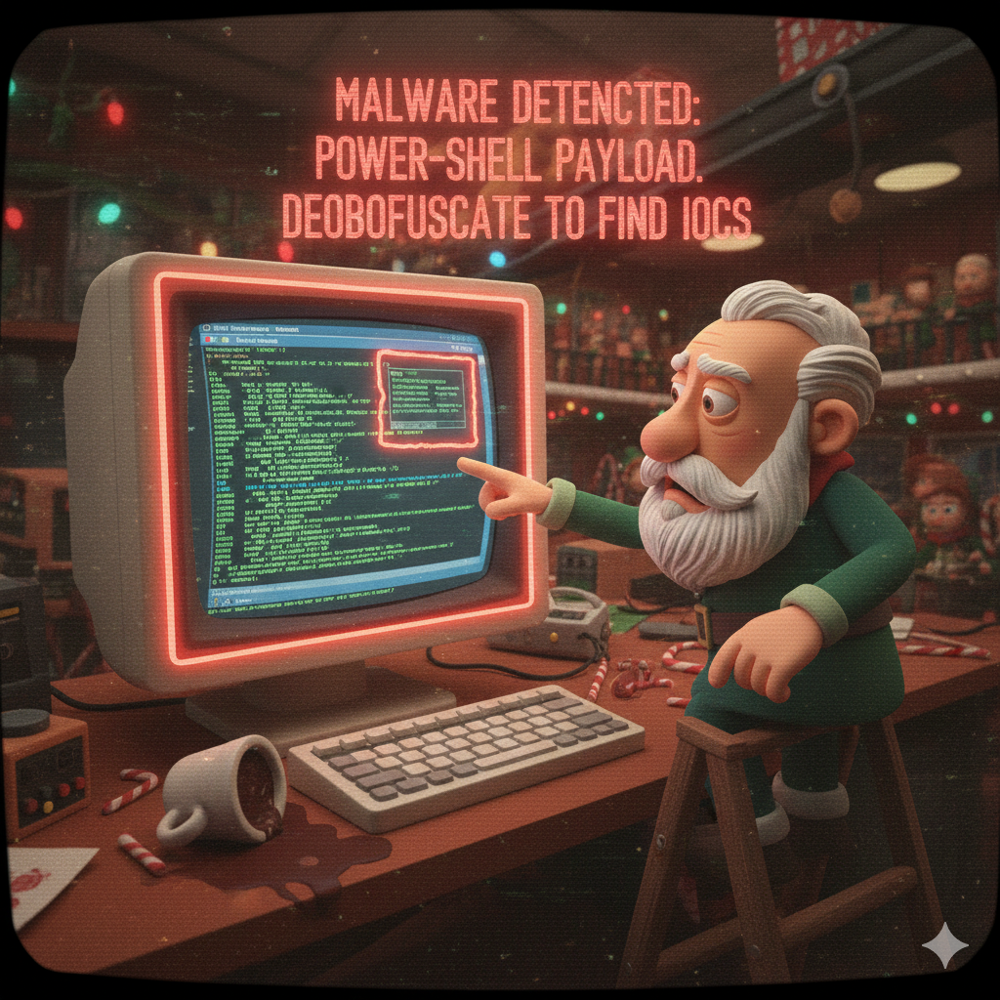

[← Previous Day](../day04/README.md) | [Main README](../README.md) | **Day 5** | [Next Day →](../day06/README.md)

---



# 🎄 Day 5 (December 16) - The PowerShell Payload

## 🎅 The Story

**December 16, 2024 - 07:30 AM (North Pole Time)**

Tom Icicle barely made it home last night before his phone started buzzing. He groans, reaching for the glowing device on his nightstand.

**4 EDR ALERTS - ELFWORKSTATION-47**
**STATUS: QUARANTINED**
**SEVERITY: HIGH**

He's dressed and out the door in five minutes, candy cane scarf trailing behind him as he rushes through the snow-covered path to the Operations Center.

When he bursts through the door, Merry Tinselcode is already there, looking like she never left. Her usually perfect workspace is littered with empty cocoa mugs, and her computer screen displays a cascade of security alerts.

"Tom! Thank goodness," she says, relief flooding her face. "The EDR went crazy overnight. Remember those two elves whose credentials were stolen in yesterday's phishing attack?"

"Pepper Frostwhisk and Tinsel Evergreen," Tom confirms, hanging his scarf on the coat rack. "What happened?"

"Pepper received a follow-up email this morning - looked like it was from IT Support, saying her account showed suspicious activity and she needed to run a 'security update script' to protect her workstation." Merry brings up the EDR timeline. "She opened a Word document attachment called 'Holiday_Bonus_Details.docm' at 7:28 AM."

Tom's eyes widen. "A macro-enabled document. Let me guess - it dropped a PowerShell script?"

"Bingo." Merry pulls up a quarantined file. "The macro executed a heavily obfuscated PowerShell script called `system_update.ps1`. Our EDR caught it in action and terminated the process, but Tom... this thing was *nasty*. Multiple encoding layers, string manipulation, the works. It's like a matryoshka doll of obfuscation."

Aisha Frostwhisper arrives with Dekker Snowball right behind her. "What's the damage?" Aisha asks, setting down her tablet.

"EDR blocked everything," Merry reassures her. "Network beaconing to a C2 server, registry persistence attempt, and it was trying to steal Chrome browser passwords. All quarantined before any data left the network."

Dekker leans over Tom's shoulder, squinting at the PowerShell code on the screen. "Is that... base64? And what are all those weird variable names? `$x1b9`? `$q5w`? This looks like alphabet soup."

"It's deliberate obfuscation," Tom explains, opening PowerShell ISE on his workstation. "The attacker doesn't want us to immediately see what the script does. They're using base64 encoding, string reversal, character substitution, XOR - layer after layer to hide the malicious payload."

Merry brings up the EDR behavioral analysis. "Look at what it tried to do:
- Network connection to `frostnet-updates.northpole-cloud.net` on port 8080
- Resolved to IP `203.0.113.99`
- Attempted to create a Run registry key for persistence
- Tried to copy itself to `AppData\Roaming\svchost.ps1`
- Accessed Chrome's credential database"

"Wait," Dekker interrupts, pointing at the screen. "203.0.113.99? That's Jack Frost's C2 infrastructure from the previous attacks! This is all connected."

Tom opens the quarantined script in PowerShell ISE. "The EDR caught the behavior, but I need to manually deobfuscate this script to extract every Indicator of Compromise. Instead of just reading the code, I'm going to **debug** it - step through line-by-line and watch the obfuscation decode in real-time."

Aisha pulls up a chair. "Walk me through it. I want to learn this technique."

Tom sets a breakpoint in the debugger. "PowerShell ISE has a built-in debugger. I can step through the script one line at a time without actually executing the dangerous commands. Watch - as I step through, the obfuscated variables will decode themselves right in front of us."

He presses F10. The first variable appears in the Variables pane: `$x1b9 = 'dGVuLmR1b2xjLW...`.

"Still obfuscated," Tom says. "But when I step to the next line..." He presses F10 again. The Variables pane updates: `$q5w = 'ten.duolc-elop...'`.

"It's backwards!" Merry realizes.

Tom steps through a few more lines. The Variables pane shows: `$k9m = 'frostnet-updates.northpole-cloud.net'`.

"There's our C2 domain," Tom says. "And I never had to actually run the malware - the debugger showed me exactly what it does. This is how we'll extract all the IOCs and find the flag Jack Frost left behind."

"Then let's get to work," Aisha says. "I want every domain, every registry key, every file path documented. And whatever flag or signature Jack embedded in this thing."

Outside, the early morning sun rises over the workshop, painting the snow in shades of pink and gold. But inside the Operations Center, the elves are about to learn advanced malware debugging techniques.

---

## 🛠️ Prerequisites & Setup

**This is your first time using a debugger!** You'll use **PowerShell ISE** - Windows' built-in PowerShell debugger.

### Tools You'll Need

**PowerShell ISE (Built-in on Windows)**
- **What it is:** Integrated Scripting Environment with debugging capabilities
- **Windows:** Already installed! (Windows 7 and later)
  - Open: Press `Win+R`, type `powershell_ise`, press Enter
  - Or: Search for "PowerShell ISE" in Start Menu
- **Why it's powerful:** Step through code line-by-line, watch variables decode live

**PowerShell Core (For Linux/Mac Users)**
- **Linux/Mac:** Install PowerShell Core (pwsh)
  ```bash
  # Ubuntu/Debian
  sudo apt-get install -y powershell

  # macOS
  brew install powershell
  ```
- Debugging works, but ISE GUI is Windows-only
- Linux/Mac users can use command-line debugging or manual decoding (see hints)

**Alternative: CyberChef (Optional Backup)**
- If PowerShell ISE doesn't work, use CyberChef for manual decoding
- https://gchq.github.io/CyberChef/

### Getting Started Checklist

Before you begin:
- [ ] Extract `day05_artifacts.zip` using Day 4's flag as password
- [ ] Open PowerShell ISE (Windows) or have PowerShell available
- [ ] Read the [PowerShell Debugging lesson](./lesson_powershell_debugging.md)
- [ ] Understand that you'll step through malware safely WITHOUT executing dangerous commands

---

## 📚 Lesson: Learn the Technique

**Before starting this challenge, read the lesson:**
📖 [PowerShell Malware Analysis with Debugging](./lesson_powershell_debugging.md)

This lesson covers:
- Why debugging is better than static analysis
- How to use PowerShell ISE debugger (breakpoints, step-over, variables pane)
- PowerShell obfuscation techniques (Base64, XOR, string reversal, character replacement)
- Safe malware debugging methodology (F10, not F5!)
- How to extract IOCs while debugging
- Real-world malware analysis workflow

**New to debugging?** Start with the lesson - it teaches you step-by-step!

---

## 🎯 **YOUR MISSION: Debug Jack Frost's PowerShell Malware!**

You are **Tom Icicle**, Senior Incident Response Analyst. Your mission is to use PowerShell ISE's debugger to deobfuscate the malware and extract the flag.

### Mission Objectives:

1. **Load the malware** in PowerShell ISE
   - Open `system_update.ps1` in the Script Pane
   - Do NOT press F5 (Run) - that would execute dangerous commands!

2. **Set breakpoints** at key variables
   - Flag pieces are hidden in `$fp1`, `$fp2`, `$fp3`, `$fp4`
   - Set breakpoints after each flag piece is assigned

3. **Debug step-by-step** with F10 (Step Over)
   - Watch variables decode in the Variables pane
   - Each step reveals one layer of obfuscation

4. **Extract the flag pieces**
   - Four variables contain the flag pieces
   - The Variables pane shows their decoded values
   - Assemble: `$fp1 + $fp2 + $fp3 + $fp4`

5. **STOP before dangerous code**
   - Don't execute network calls, registry writes, or file operations
   - You'll have the flag before reaching those lines

---

## 🔍 Artifacts

**Password required:** Use Day 4's flag to extract `day05_artifacts.zip`

```bash
7z x day05_artifacts.zip -p"FROST{ph1sh1ng_s34s0n_gr33t1ngs}"
```

In the `artifacts/` folder you'll find:

| File | Description |
|------|-------------|
| `system_update.ps1` | Heavily obfuscated PowerShell malware (main challenge) |
| `edr_alert.json` | EDR behavioral telemetry showing what the malware attempted |
| `normal_script.ps1` | Legitimate PowerShell script for comparison |
| `deobfuscation_guide.txt` | Quick reference for obfuscation techniques |

---

## 📖 **Step-by-Step Debugging Guide**

### Step 1: Open PowerShell ISE

**Windows:**
```
Press Win+R → Type: powershell_ise → Press Enter
```

**You should see three panes:**
- **Script Pane** (top) - Where you'll load the malware
- **Console Pane** (bottom) - Interactive PowerShell
- **Variables Pane** (right) - Shows all variable values

**If Variables Pane is missing:** View → Show Script Pane Right

---

### Step 2: Load the Malware

1. **File → Open**
2. **Navigate to:** `day05/artifacts/`
3. **Select:** `system_update.ps1`

You'll see heavily obfuscated PowerShell code with weird variable names like `$x1b9`, `$q5w`, `$fp1`, etc.

⚠️ **DO NOT PRESS F5!** That would run the malware. We'll use F10 to debug safely.

---

### Step 3: Set Breakpoints

The flag is split across four variables: `$fp1`, `$fp2`, `$fp3`, `$fp4`

**Set breakpoints on these lines:**
- **Line 26:** After `$fp1 =` (Flag Piece 1 - XOR encoded)
- **Line 39:** After `$fp2 =` (Flag Piece 2 - Base64 + Reverse)
- **Line 49:** After `$fp3 =` (Flag Piece 3 - Character Replace + Reverse)
- **Line 56:** After `$fp4 =` (Flag Piece 4 - Base64)

**How to set breakpoints:**
- Click in the left margin next to the line number (red dot appears)
- Or: Put cursor on the line, press **F9**

---

### Step 4: Start Debugging with F10 (Step Over)

**Click on Line 1** (the first comment), then **press F10** repeatedly.

**What happens:**
- Each **F10** press executes ONE line of code
- The **yellow highlight** shows the current line
- The **Variables pane** updates with new/changed variables

**Keep pressing F10** and watch the Variables pane. You'll see obfuscated variables decode step-by-step!

**Example progression:**
```
Press F10 → Line 14: $x1b9 = 'dGVuLmR1b2xjLWVsb3Bocm9uLnNldGFkcHUtdGVuc3RvcmY='
Press F10 → Line 15: $q5w = 'ten.duolc-elophron.setadpu-tenstorf' (decoded but backwards)
Press F10 → Line 17: $k9m = 'frostnet-updates.northpole-cloud.net' (fully decoded!)
...
Press F10 → Line 26: $fp1 = 'FROST' (Flag Piece 1!)
```

---

### Step 5: Extract the Flag Pieces

As you step through, the **Variables pane** will show the decoded flag pieces:

**After Line 26:**
- `$fp1 = "FROST"`

**After Line 39:**
- `$fp2 = "{p0w3rsh3ll_"`

**After Line 49:**
- `$fp3 = "0bfusc@t10n_m@st3"`

**After Line 56:**
- `$fp4 = "r}"`

**Write them down or screenshot the Variables pane!**

---

### Step 6: Assemble the Flag

Concatenate all four pieces:

```
$fp1 + $fp2 + $fp3 + $fp4
= [piece1] + [piece2] + [piece3] + [piece4]
= FROST{...}
```

**Your flag:** Concatenate the four decoded pieces to get the complete flag!

---

### Step 7: STOP Debugging

Once you have the flag, **Press Shift+F5** or **Debug → Stop Debugger**

**Why stop?**
- Lines 59-86 contain dangerous code (network C2, registry persistence, credential theft)
- You don't need to execute those to get the flag
- If curious, you can keep stepping (F10) - the commands will fail safely

---

## 🧪 **What You're Learning**

### Technical Skills:
- ✅ Using PowerShell ISE debugger (breakpoints, stepping, variable inspection)
- ✅ Debugging malware safely without executing dangerous commands
- ✅ Understanding PowerShell obfuscation (Base64, XOR, reversal, character replacement)
- ✅ Extracting IOCs from obfuscated scripts

### Security Concepts:
- ✅ How attackers hide C2 domains and malicious behavior
- ✅ PowerShell persistence mechanisms (Registry Run keys)
- ✅ Credential theft techniques (Chrome password database)
- ✅ Why debugging reveals more than static analysis

### MITRE ATT&CK:
- **Tactic:** TA0005 - Defense Evasion
- **Technique:** T1027 - Obfuscated Files or Information
- **Sub-technique:** T1027.010 - Command Obfuscation
- **Execution:** T1059.001 - PowerShell
- **Persistence:** T1547.001 - Registry Run Keys
- **Credential Access:** T1555.003 - Credentials from Web Browsers

---

## 🎓 **Bonus Challenges (Optional)**

Want to learn more? Try these:

### Challenge 1: Extract All IOCs

While debugging, identify:
- **C2 Domain:** What domain does the malware beacon to?
- **C2 IP:** What IP address resolves to?
- **C2 Port:** What port does it use?
- **Registry Key:** What persistence registry key does it create?
- **File Path:** Where does it copy itself?
- **Exfiltration Target:** What file does it try to steal?

### Challenge 2: Compare with Normal Script

Open `normal_script.ps1` - this is a legitimate PowerShell update script.

**Question:** What makes `system_update.ps1` suspicious compared to the normal one?

### Challenge 3: Understand Each Obfuscation Layer

**Flag Piece 1 (XOR):**
- How does XOR encoding work?
- Why use XOR key 110?

**Flag Piece 2 (Base64 + Reverse):**
- What does Base64 decode to before reversal?
- Why reverse the string?

**Flag Piece 3 (Character Replace + Reverse):**
- What characters are substituted? (X→0, Y→@, Z→3)
- Why use leetspeak in the flag?

**Flag Piece 4 (Base64):**
- Simplest encoding - just Base64
- What does `cn0=` decode to?

---

## 🛡️ **Defense Strategies**

Now that you understand PowerShell obfuscation, here's how to defend:

### 1. PowerShell Logging
```powershell
# Enable Script Block Logging (Windows Event Log)
Group Policy: Computer Configuration → Administrative Templates →
Windows Components → Windows PowerShell → Turn on PowerShell Script Block Logging
```

### 2. Constrained Language Mode
```powershell
# Restrict PowerShell capabilities
$ExecutionContext.SessionState.LanguageMode = "ConstrainedLanguage"
```

### 3. AMSI (Antimalware Scan Interface)
- Windows 10+ automatically scans PowerShell scripts
- Detects obfuscation patterns

### 4. EDR Behavioral Detection
- Monitor for: Base64 decoding + Invoke-Expression
- Alert on: Registry Run key creation
- Block: Chrome credential database access

### 5. Application Whitelisting
- Only allow approved PowerShell scripts
- Require code signing

---

## ❓ Need Help?

- **Can't open PowerShell ISE?** See [hints.md](./hints.md) - Hint 1
- **Don't see Variables pane?** See [hints.md](./hints.md) - Hint 2
- **Don't know where to set breakpoints?** See [hints.md](./hints.md) - Hint 4
- **Can't find flag pieces in Variables pane?** See [hints.md](./hints.md) - Hints 7-10
- **Need the full solution?** See [hints.md](./hints.md) - Hint 13

**Progressive hints available** - from basic debugging to complete walkthrough.

---

## 📚 **Additional Resources**

**PowerShell Security:**
- Microsoft: PowerShell Security Best Practices
- SANS: PowerShell for Security Professionals
- FireEye: PowerShell Obfuscation Detection

**Malware Analysis:**
- MalwareBazaar: Real PowerShell malware samples
- ANY.RUN: Interactive malware sandbox
- Joe Sandbox: Automated malware analysis

---

## 🏁 **Next Steps**

Once you have the flag (in `FROST{...}` format), you're ready for Day 6!

**Use your Day 5 flag to unlock:**
```bash
7z x day06_artifacts.zip -p"YOUR_DAY5_FLAG"
```

**What's Next?**
Day 6: Jack Frost conducts reconnaissance on the Reindeer Stable web application. You'll use web scanning tools to discover what he found!

---

**Challenge Status:** 🟢 Ready to solve!
**Difficulty:** ⭐⭐⭐ Intermediate-Advanced
**Time Estimate:** 45-60 minutes
**Tools Required:** PowerShell ISE (Windows) or PowerShell Core (Linux/Mac)

---

[← Previous Day](../day04/README.md) | [Main README](../README.md) | **Day 5** | [Next Day →](../day06/README.md)
