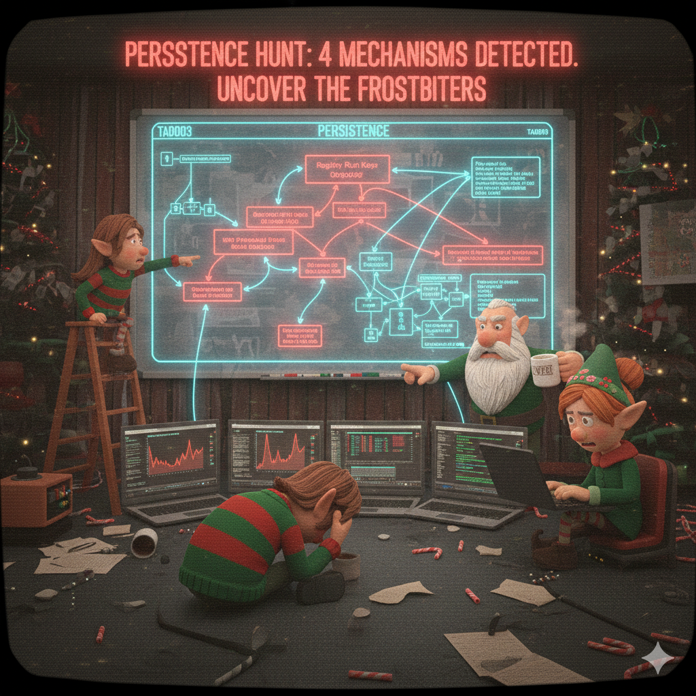

[← Previous Day](../day09/README.md) | [Main README](../README.md) | **Day 10** | [Next Day →](../day11/README.md)

---



# 🎄 Day 10 (December 21) - Persistent Frost Biters

## 🎅 The Story

**December 21, 2024 - 09:15 AM (North Pole Time)**

Tom Icicle stares at his terminal, coffee growing cold beside him. After yesterday's API key leak gave Jack Frost access to classified security intel, the team rotated all credentials and implemented proper authorization checks. But something feels wrong.

"Tom, we have a problem," Dekker Frostbeard's voice cuts through the SOC. "I was reviewing the Gift Tracking API access logs from before we locked down the endpoint. Jack Frost wasn't just *reading* our security notes—he was actively querying our infrastructure documentation."

Merry Tinselcode wheels her chair over, pulling up the API response logs on her second monitor. "Look at this. On December 19th at 11:47 PM, Jack made 23 requests to `/api/v2/admin/secrets`. He extracted our entire security posture—including our incident response playbooks and system architecture diagrams."

"That's not the worst part," Dekker continues grimly. "Look at what else was in that admin endpoint response."

Tom leans forward, reading the JSON output:

```json
{
  "classified_intel": [
    "Active IR investigation: SQL injection on nice_list database",
    "Compromised systems: nice_list_db, gift_api_gateway",
    "Known attacker IP: 203.0.113.99",
    "Defense gaps: No EDR on workshop systems, limited logging"
  ]
}
```

"Jack knows we don't have endpoint detection on the workshop systems," Tom says slowly. "And he knows from our incident notes that we're focused on the database and API servers. The workshop systems are..."

"Unmonitored," Merry finishes. "No Sysmon, no EDR, just basic Windows Defender. If he deployed malware on those systems, we might not see it."

Sarah Hollycode rushes in, laptop in hand. "Tom! I was running our weekly vulnerability scan on the workshop network and found something. Four workstations—WORKSHOP-WIN01 through WORKSHOP-WIN04—all have unusual system artifacts that weren't there three days ago."

She displays her findings:

**WORKSHOP-WIN01:**
- Registry Run key: `HKCU\Software\Microsoft\Windows\CurrentVersion\Run\WindowsSecurityUpdate`
- Created: December 19, 2024 11:52 PM
- Points to: `C:\ProgramData\WindowsUpdate\SecurityUpdate.exe`

**WORKSHOP-WIN02:**
- Scheduled Task: `WindowsMaintenanceTask`
- Created: December 19, 2024 11:54 PM
- Trigger: User logon (Hidden task)
- Action: Executes PowerShell script from ProgramData

**WORKSHOP-WIN03:**
- WMI Event Subscription: `__EventFilter_SystemHealth`
- Created: December 19, 2024 11:56 PM
- Triggers every 60 seconds
- Executes: CommandLineEventConsumer

**WORKSHOP-WIN04:**
- Windows Service: `WindowsSecurityUpdateService`
- Created: December 19, 2024 11:58 PM
- Startup Type: Automatic
- Runs as: LocalSystem

"Four persistence mechanisms," Tom says, his voice cold. "Four different techniques. Registry Run keys, scheduled tasks, WMI event subscriptions, and Windows services. Jack Frost studied our defenses, identified our blind spot, and deployed **textbook APT persistence** across our workshop network."

Dekker's jaw tightens. "The timestamps. December 19th, 11:52 PM to 11:58 PM. That's exactly six minutes after he exfiltrated our security documentation from the API endpoint. He read our playbooks and immediately adapted his attack."

"This is advanced persistent threat tradecraft," Ginger Snowflake, the database admin who discovered Day 8's SQL injection, joins the conversation. "APT29, APT41, Lazarus Group—they all use multiple redundant persistence mechanisms. Even if we find and remove one, the others keep them in the network."

Aisha Frostwhisper brings up the MITRE ATT&CK framework on the main SOC display:

**MITRE ATT&CK - Tactic TA0003: Persistence**
- T1547.001 - Registry Run Keys / Startup Folder
- T1053.005 - Scheduled Task/Job: Scheduled Task
- T1546.003 - Event Triggered Execution: Windows Management Instrumentation Event Subscription
- T1543.003 - Create or Modify System Process: Windows Service

"Each of these techniques is used by real-world APT groups," Aisha explains. "Jack Frost isn't just deploying malware—he's following the same playbook as nation-state attackers."

Tom stands up, addressing the team. "Here's the situation:

1. **Day 8**: Jack used SQL injection to steal the Nice List database
2. **Day 9**: Jack exploited a leaked API key to access our classified security intel
3. **Day 10**: Jack deployed four persistence mechanisms on our workshop systems—systems he KNEW we weren't monitoring closely

This is a coordinated, multi-stage attack. And now he has persistence. He can survive reboots, user logouts, and even some security tools. We need to hunt down every single mechanism and understand exactly what he deployed."

Merry pulls up the workshop system images. "I've isolated the affected workstations from the production network. I can spin up forensic copies of their system states in our lab environment. If we can safely deploy Jack's persistence mechanisms in a sandboxed environment, we can analyze them without risk."

"Do it," Dekker orders. "Tom, you're leading the persistence hunt. Deploy the malware simulator in the lab, then use every forensic tool we have to hunt down all four mechanisms. I want to know exactly how Jack Frost is maintaining access."

Tom cracks his knuckles and opens his forensics toolkit. "Let's go hunting."

Outside, four days until Christmas. Inside the North Pole SOC, the team is about to learn how advanced attackers maintain long-term access to compromised networks.

---

## 🎯 **YOUR MISSION: Hunt the Persistence Mechanisms!**

You will:
✅ Deploy Jack Frost's persistence mechanisms safely in a lab environment
✅ Hunt down 4 different Windows persistence techniques using specialized tools
✅ Extract flag fragments from each mechanism (some are encoded!)
✅ Understand how APT groups maintain access after initial compromise
✅ Clean up all persistence when done

**You're learning real persistence hunting skills used by SOC analysts and incident responders!**

---

## 🛠️ Prerequisites & Setup

**You'll need:**
- **Python 3.7 or higher**
- **Administrator privileges** (for some detection features)
  - Registry scanning works without admin
  - Full WMI/Service enumeration may require elevated rights
- **Antivirus temporarily disabled** (optional but recommended)
  - The simulator creates "malicious" patterns that AV may flag
  - These are safe educational artifacts

**Completed Day 9?** You'll need the Day 9 flag to unlock these artifacts!

### Quick Setup Check:

```powershell
# Verify Python is installed
python --version

# Should show Python 3.7 or higher
```

---

## 📚 Lesson: Learn the Technique

**Before starting this challenge, read the lesson:**
📖 [Windows Persistence Mechanisms](./LESSON.md)

This comprehensive lesson covers:
- What persistence is and why attackers use it
- The 4 persistence techniques in this challenge (Registry, Tasks, WMI, Services)
- How each technique works under the hood
- Detection methods for each mechanism
- Real-world APT groups that use these techniques
- Encoding schemes (Base64, ROT13, hex)
- MITRE ATT&CK framework mapping

**New to Windows persistence?** The lesson assumes zero prior knowledge and teaches you everything!

**Already familiar with persistence?** Jump straight to the challenge! 🚀

---

## 🔍 Artifacts

**Password required:** Use Day 9's flag to extract `artifacts.7z`

In the `artifacts/` folder you'll find:

- **`malware_simulator.py`** - Simulates Jack Frost's persistence deployment
  - Creates 4 persistence mechanisms safely
  - Generates artifact files for analysis
  - Displays mission briefing with hints
  - ⚠️ Creates REAL Windows registry keys! Only run on test systems!

- **`reg_analyzer.py`** - Registry Run Key hunter
  - Scans `HKCU\Software\Microsoft\Windows\CurrentVersion\Run`
  - Identifies suspicious entries
  - Extracts and decodes Base64-encoded flag fragment

- **`task_analyzer.py`** - Scheduled Task analyzer
  - Parses scheduled task XML files
  - Identifies hidden tasks with elevated privileges
  - Extracts flag fragment from task metadata

- **`wmi_hunter.py`** - WMI Event Subscription hunter
  - Analyzes WMI Event Filters, Consumers, and Bindings
  - Identifies event-driven persistence
  - Extracts flag fragment from subscription metadata

- **`service_analyzer.py`** - Windows Service analyzer
  - Enumerates Windows services
  - Identifies services mimicking legitimate Windows services
  - Decodes ROT13-encoded flag fragment

- **`cleanup_persistence.py`** - Cleanup tool
  - Removes all 4 persistence mechanisms
  - Deletes artifact files
  - ⚠️ Always run this when done!

---

## 🚀 Quick Start

```bash
# 1. Extract the artifacts using Day 9's flag as the password
# Hint: The flag you got from Day 9's API exploitation

# 2. Change to artifacts directory
cd artifacts

# 3. Deploy the persistence mechanisms (safe simulation!)
python malware_simulator.py

# 4. Hunt them down with detection tools:
python reg_analyzer.py           # Find Registry Run Key persistence
python task_analyzer.py          # Analyze Scheduled Tasks
python wmi_hunter.py             # Hunt WMI Event Subscriptions
python service_analyzer.py       # Examine Windows Services

# 5. Clean up when done
python cleanup_persistence.py
```

---

## 🎯 The Challenge

You are **Tom Icicle**, Incident Response Lead. Your mission: hunt down all 4 persistence mechanisms Jack Frost deployed on the workshop systems.

**Step-by-Step Process:**

### Phase 1: Deployment (5 minutes)

Run the malware simulator to create persistence mechanisms:

```bash
python malware_simulator.py
```

**What it does:**
- Creates 4 persistence mechanisms in your Windows system
- Generates artifact files in `persistence_artifacts/` directory
- Displays a mission briefing with hints
- Creates a safe, educational environment (no actual malicious activity!)

⚠️ **IMPORTANT:** This creates REAL Windows registry keys and system files. Only run on test systems!

---

### Phase 2: Hunt #1 - Registry Run Keys (10 minutes)

**Target:** Classic startup persistence (MITRE T1547.001)

```bash
python reg_analyzer.py
```

**Your Task:**
1. The tool scans `HKCU\Software\Microsoft\Windows\CurrentVersion\Run`
2. Identifies suspicious entries (look for "WindowsSecurityUpdate")
3. Extracts the **Base64-encoded fragment** from the referenced file
4. Decodes it to reveal the first part of the flag

**Learning Objectives:**
- Understand Windows Run key persistence
- Recognize suspicious registry value names
- Decode Base64 data in malware payloads

💡 **Hint:** The registry value points to a file. Read the file to find the encoded fragment!

---

### Phase 3: Hunt #2 - Scheduled Tasks (10 minutes)

**Target:** Time-based execution persistence (MITRE T1053.005)

```bash
python task_analyzer.py
```

**Your Task:**
1. Locates scheduled task XML files in artifacts directory
2. Parses task configuration (triggers, actions, hidden settings)
3. Identifies suspicious characteristics (hidden task, elevated privileges)
4. Extracts fragment from custom Data element

**Learning Objectives:**
- Parse Windows scheduled task XML format
- Identify malicious task configurations
- Find hidden data in task metadata

💡 **Hint:** Look for tasks that run on user logon with "Hidden" enabled!

---

### Phase 4: Hunt #3 - WMI Event Subscriptions (15 minutes)

**Target:** Event-driven persistence (MITRE T1546.003)

```bash
python wmi_hunter.py
```

**Your Task:**
1. Learn about WMI Event Subscriptions (Filter → Consumer → Binding)
2. Analyze WMI subscription configuration files
3. Identify the event filter (what triggers it)
4. Find the consumer command (what executes)
5. Extract fragment from HTML comment metadata

**Learning Objectives:**
- Understand WMI persistence architecture
- Recognize Event Filters vs Event Consumers
- Identify malicious WMI configurations

💡 **Hint:** WMI subscriptions consist of 3 parts. Check the metadata section!

---

### Phase 5: Hunt #4 - Malicious Services (15 minutes)

**Target:** System-level persistence (MITRE T1543.003)

```bash
python service_analyzer.py
```

**Your Task:**
1. Find service configuration files
2. Analyze service properties (name, start type, privileges)
3. Identify services that mimic legitimate Windows services
4. Decode **ROT13-encoded fragment** from service metadata

**Learning Objectives:**
- Enumerate Windows services
- Recognize service name impersonation techniques
- Decode ROT13 encoding

💡 **Hint:** Check the "ConfigHash" in service metadata. It's ROT13 encoded!

---

### Phase 6: Assemble the Flag

**Combine all 4 fragments in order:**

Each of the 4 detection tools will extract one fragment of the flag:
- Fragment 1: Found by `reg_analyzer.py` (Base64 encoded in registry artifact)
- Fragment 2: Found by `task_analyzer.py` (hidden in task XML metadata)
- Fragment 3: Found by `wmi_hunter.py` (in WMI subscription metadata)
- Fragment 4: Found by `service_analyzer.py` (ROT13 encoded in service config)

Combine them in order to get the complete flag!

🎉 **Once you've assembled the flag, you've successfully hunted all 4 persistence mechanisms!**

---

### Phase 7: Cleanup (5 minutes)

**CRITICAL:** Remove all persistence mechanisms when done:

```bash
python cleanup_persistence.py
```

**What it removes:**
- Registry Run key entries
- Scheduled task XML files
- WMI subscription data files
- Service configuration files
- All artifacts in `persistence_artifacts/` directory

⚠️ **Always run cleanup!** These are test artifacts but should not remain on your system.

---

## 🛡️ Real-World Application

**These techniques are used in REAL attacks:**

### APT Groups Using These Techniques:
- **APT29 (Cozy Bear)** - WMI event subscriptions for stealth
- **APT41** - Registry Run keys + scheduled tasks
- **FIN7** - Malicious Windows services
- **Lazarus Group** - Combination of all 4 techniques

### Real Incidents:
- **SolarWinds Attack (2020)** - Used service persistence
- **NotPetya (2017)** - Scheduled task persistence
- **APT29 (2021)** - WMI event subscription techniques
- **Emotet** - Registry Run key persistence

### Why Defenders Need These Skills:
1. **Incident Response** - Finding hidden malware during investigations
2. **Threat Hunting** - Proactively searching for persistence mechanisms
3. **Forensics** - Analyzing compromised systems
4. **Detection Engineering** - Building rules to catch these techniques

**Your ability to hunt persistence makes you dangerous to attackers! 🎯**

---

## ❓ Troubleshooting

**Problem:** "This tool requires Windows OS"
**Solution:** This challenge creates real Windows registry keys and system artifacts. Use a Windows VM or physical machine.

**Problem:** "Permission denied" when accessing registry
**Solution:**
- Most registry scanning works without admin rights
- For full access, run Command Prompt as Administrator
- Right-click → "Run as administrator"

**Problem:** "No persistence files found"
**Solution:**
- Make sure you ran `python malware_simulator.py` first
- Check that `persistence_artifacts/` directory exists
- Confirm files were created (dir or ls the directory)

**Problem:** "Antivirus blocked the simulator"
**Solution:**
- Temporarily disable antivirus (Windows Defender or other)
- Add exception for the artifacts directory
- These are educational artifacts, not real malware

**Problem:** "Can't decode the fragments"
**Solution:**
- Registry fragment: Use Base64 decoder (or the tool decodes automatically)
- Service fragment: Use ROT13 decoder (rotate each letter 13 positions)
- Other fragments: Plain text in the files

**Problem:** "Tools aren't finding the persistence"
**Solution:**
- Ensure you're running from the `artifacts/` directory
- Check that `persistence_artifacts/` folder contains files
- Re-run `malware_simulator.py` if files are missing

**Problem:** "Cleanup didn't remove everything"
**Solution:**
- Manually delete the `persistence_artifacts/` folder
- Check registry: `reg query "HKCU\Software\Microsoft\Windows\CurrentVersion\Run"`
- Remove manually if needed: `reg delete "HKCU\...\Run" /v WindowsSecurityUpdate /f`

---

## 📖 Additional Resources

**Want to dive deeper?**

- **MITRE ATT&CK**: https://attack.mitre.org/tactics/TA0003/
  - T1547.001 - Registry Run Keys
  - T1053.005 - Scheduled Task
  - T1546.003 - WMI Event Subscription
  - T1543.003 - Windows Service

- **Tools for Real-World Hunting:**
  - Sysinternals Autoruns (GUI for persistence)
  - PowerShell: `Get-WmiObject`, `Get-ScheduledTask`, `Get-Service`
  - Velociraptor (open-source EDR)
  - OSQuery (system telemetry)

- **Further Reading:**
  - "The Art of Memory Forensics" - Windows persistence chapter
  - Microsoft Sysinternals documentation
  - SANS DFIR posters and cheat sheets

---

## ➡️ Next Steps

Once you've hunted down all the persistence mechanisms and captured the flag, use it to unlock **Day 11's** artifacts:

1. Navigate to `../day11/`
2. Find `artifacts.7z`
3. Use your Day 10 flag (including `FROST{}`) as the password
4. Continue the investigation...

Jack Frost has persistence on the workshop systems. What's his next move? 🎄

---

**Difficulty:** Medium-High (hands-on persistence hunting)
**Estimated Time:** 60-90 minutes
**Skills:** Windows forensics, registry analysis, scheduled tasks, WMI, services, encoding, MITRE ATT&CK
**Tools Needed:** Python 3
**Uses Previous Skills:**
- ✅ Multi-layer decoding (Day 1 - Base64, ROT13)
- ✅ Pattern recognition (Days 2-4)
- ✅ Log analysis understanding (Days 3, 6, 7)
- ✅ Hands-on exploitation (Days 8-9)

**NEW Skills Learned:**
- ✅ Windows persistence hunting
- ✅ Registry Run key analysis
- ✅ Scheduled task forensics
- ✅ WMI event subscription detection
- ✅ Windows service enumeration
- ✅ Multi-encoding decryption (Base64, ROT13)
- ✅ MITRE ATT&CK mapping
- ✅ Systematic threat hunting methodology

---

## 🎓 Defensive Insights

**What You're Learning:**

This challenge teaches critical persistence hunting skills used in real incident response:

**Detection Best Practices:**
- ✅ Check ALL persistence locations, not just registry
- ✅ Use specialized tools for each mechanism
- ✅ Look for name impersonation (WindowsDefender vs Windows Defender)
- ✅ Decode obfuscated data (Base64, ROT13, hex)
- ✅ Map findings to MITRE ATT&CK framework

**Prevention Best Practices:**
- ✅ Enable Sysmon to log registry/WMI/service changes
- ✅ Deploy EDR on all systems (not just servers!)
- ✅ Use application whitelisting (AppLocker)
- ✅ Apply principle of least privilege
- ✅ Monitor for new Run keys, tasks, WMI subscriptions, services

**Incident Response:**
- ✅ Hunt ALL mechanisms (attackers deploy multiple for redundancy)
- ✅ Document findings before removal
- ✅ Collect forensic artifacts
- ✅ Investigate initial compromise vector

---

🎄 **You've completed Day 10! You're now a certified Persistence Hunter!** ❄️

Remember: Always run cleanup when done! 🧹

*Good luck hunting, and may your forensic skills protect the North Pole! 🎅*
