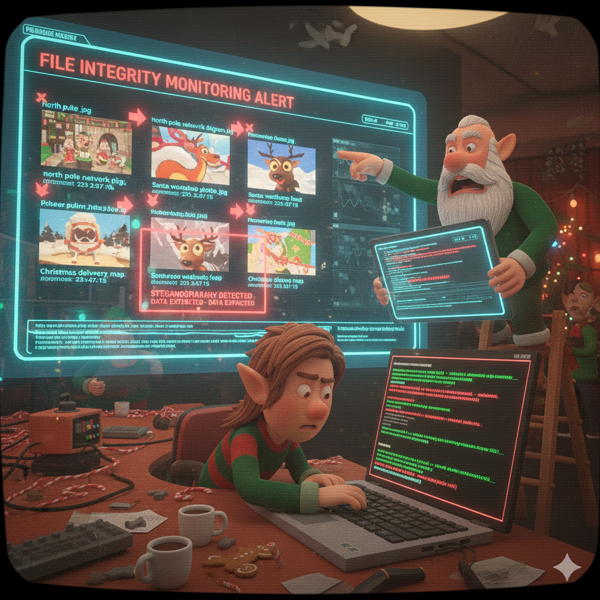

[← Previous Day](../day10/README.md) | [Main README](../README.md) | **Day 11** | [Next Day →](../day12/README.md)

---



# 🎄 Day 11 (December 22) - Hidden in Plain Sight

## 🎅 The Story

**December 22, 2024 - 09:30 AM (North Pole Time)**

Sarah Hollycode, the North Pole's Web Application Security Engineer, bursts into the Security Operations Center with her laptop, her expression a mix of confusion and concern.

"Dekker, we have something strange," she says, pulling up a folder of image files on the main monitor. "Our file integrity monitoring flagged several images on the shared drive. They were accessed and modified last night by an unauthorized account."

Dekker Frostbeard wheels his chair over, stroking his frost-tipped beard thoughtfully. "Modified how? Are they corrupted?"

"That's the weird part," Sarah explains, clicking through the images. "They look completely normal. Network diagram, workshop photos, security cam footage, delivery maps - all standard North Pole operational images. But the file sizes increased by a few kilobytes, and the modification timestamps all match: 23:47:15 last night."

Tom Icicle, the Incident Response Lead, looks up from his terminal. "23:47? That's the same time Jack Frost's persistence mechanisms activated on the compromised workstation."

Merry Tinselcode pulls up the file access logs. "The images were accessed from IP 203.0.113.99 - Jack Frost's command and control server. He definitely touched these files."

"But why?" Dekker asks. "What would he want with our operational images?"

Sarah's eyes widen. "**Steganography**. He could be hiding stolen data inside the images. That's why they look normal but the file sizes changed - he embedded data in them!"

Tom stands up, now fully alert. "That's brilliant from an attacker's perspective. Hide the exfiltrated data in innocent-looking image files. If someone reviews the network traffic, they just see image downloads - nothing suspicious."

"Can we extract whatever he hid?" Dekker asks.

"If we know what tool he used," Sarah replies. "The most common steganography tool is `steghide`. It can hide data in image and audio files. But we'll need the password he used to embed it."

Merry is already scanning through the investigation notes. "Wait, I found Jack Frost's PowerShell command history from the compromised workstation. There's a steghide command here with a password: `northpole2024`. That might work!"

Dekker nods decisively. "Alright team, here's the mission: use steghide to extract any hidden data from these images. Find out what Jack Frost exfiltrated and get proof of the breach. Merry, you're on point for this one."

"On it," Merry says, cracking her knuckles. "Time to see what secrets are hiding in plain sight."

Outside, fresh snow falls gently on the North Pole. Inside the SOC, the elves prepare to uncover data hidden where no one would think to look.

---

## 🎯 **YOUR MISSION: Uncover Jack Frost's Hidden Data!**

You will:
✅ Install and use **steghide** to extract hidden data from image files
✅ Find the password Jack Frost used in his attack
✅ Test multiple images to identify which contain hidden data
✅ Distinguish real evidence from fake flags Jack Frost planted
✅ Understand how attackers use steganography for data exfiltration

**You're learning real digital forensics skills used by incident responders!**

---

## 🛠️ Prerequisites & Setup

**You'll need:**
- **Windows 10/11 with WSL (Windows Subsystem for Linux)** - Required for steghide
  - Most students will use WSL - full instructions below
- **OR** Linux/macOS with steghide installed
- **Completed Day 10?** You'll need the Day 10 flag to unlock these artifacts!

### Setting Up WSL (Windows Users - First Time)

**If you don't have WSL installed yet:**

```powershell
# 1. Open PowerShell as Administrator
#    (Right-click PowerShell → "Run as administrator")

# 2. Install WSL
wsl --install

# 3. Restart your computer when prompted

# 4. After restart, Ubuntu will open automatically
#    Create a username and password when asked
```

**If you already have WSL:**

```powershell
# Just open PowerShell or Command Prompt and type:
wsl

# You'll see your Linux prompt (like: username@computer:~$)
```

### Installing Steghide

**Once in WSL (or if using Linux/macOS):**

```bash
# Update package list
sudo apt update

# Install steghide
sudo apt install steghide -y

# Verify it works
steghide --version
# Should show: steghide version 0.5.1
```

---

## 📚 Lesson: Learn the Technique

**Before starting this challenge, read the lesson:**
📖 [Steganography - Hiding Data in Plain Sight](./lesson_steganography.md)

This comprehensive lesson covers:
- What steganography is and how it works (LSB technique)
- How attackers use stego to exfiltrate data undetected
- Tools: steghide, binwalk, exiftool, strings
- How to detect steganography in files
- Real-world APT examples and MITRE ATT&CK mapping

**New to steganography?** The lesson assumes zero prior knowledge!

**Already familiar with stego?** Jump straight to the challenge! 🚀

---

## 🔍 Artifacts

**Password required:** Use Day 10's flag to extract `artifacts.7z`

In the `artifacts/` folder you'll find:

- **`north_pole_network_diagram.jpg`** - Network infrastructure diagram
- **`santa_workshop_photo.jpg`** - Photo of workshop interior
- **`reindeer_webcam_feed.jpg`** - Security camera screenshot
- **`christmas_delivery_map.jpg`** - World map with delivery routes
- **`investigation_notes.txt`** - Security team's findings and password clue
- **`steghide_quickstart.txt`** - Basic steghide command reference

⚠️ **IMPORTANT:** Some images have embedded data, some are decoys! Not all images will extract data.

---

## 🚀 Quick Start

```bash
# 1. Extract the artifacts using Day 10's flag as the password
# Hint: The flag you got from Day 10's persistence hunting challenge

# 2. Open WSL (Windows users)
wsl

# 3. Navigate to the artifacts folder
cd /mnt/c/Users/YOUR_USERNAME/Desktop/12-days-of-cyber/day11/artifacts

# 4. Read investigation notes to find the steghide password
cat investigation_notes.txt | grep -i password

# 5. Extract from each image using steghide (replace PASSWORD with what you found)
steghide extract -sf north_pole_network_diagram.jpg -p "PASSWORD"
steghide extract -sf santa_workshop_photo.jpg -p "PASSWORD"
steghide extract -sf reindeer_webcam_feed.jpg -p "PASSWORD"
steghide extract -sf christmas_delivery_map.jpg -p "PASSWORD"

# 6. Read extracted files
cat hint_message.txt
cat flag_secret.txt
cat fake_flag.txt
```

---

## 🎯 The Challenge

You are **Merry Tinselcode**, Senior Security Elf. Your mission: extract hidden data that Jack Frost embedded in image files and find the investigation flag.

**Step-by-Step Process:**

### Phase 1: Navigate to Artifacts (5 minutes)

**Windows Users:**

```powershell
# 1. Open PowerShell or Command Prompt

# 2. Type this to enter WSL:
wsl

# 3. Navigate to the artifacts folder (replace YOUR_USERNAME with your Windows username)
cd /mnt/c/Users/YOUR_USERNAME/Desktop/12-days-of-cyber/day11/artifacts

# 4. Verify you're in the right place
pwd
ls -la
```

**Expected output:**
```
/mnt/c/Users/YOUR_USERNAME/Desktop/12-days-of-cyber/day11/artifacts
north_pole_network_diagram.jpg
santa_workshop_photo.jpg
reindeer_webcam_feed.jpg
christmas_delivery_map.jpg
investigation_notes.txt
steghide_quickstart.txt
```

💡 **Hint:** In WSL, Windows drives are mounted under `/mnt/`. Your C: drive is `/mnt/c/`

**Linux/macOS Users:**

```bash
cd ~/Desktop/12-days-of-cyber/day11/artifacts
ls -la
```

---

### Phase 2: Find the Password (10 minutes)

**Your Task:**
1. Read the investigation notes file
2. Find Jack Frost's PowerShell command history
3. Locate the password he used with steghide

```bash
# Read the entire investigation file
cat investigation_notes.txt
```

**What to look for:**
- Search for the word "password" (around line 74-76)
- Look for a steghide command showing how Jack used the tool
- The password will be in quotes after `-p`

**Quick method:**
```bash
# Search for the password
grep -i "password" investigation_notes.txt
```

**Expected output (partial):**
```
The password Jack Frost used for steghide embeddings is:
   ►►► PASSWORD: northpole2024 ◄◄◄
```

💡 **Hint:** The password is exactly: `northpole2024` (no quotes needed when using it)

---

### Phase 3: Understand Steghide Commands (5 minutes)

**Basic steghide extraction command:**

```bash
steghide extract -sf IMAGE_FILE.jpg -p "PASSWORD"
```

**What each part means:**
- `steghide extract` = Extract hidden data
- `-sf` = "stego file" (the image containing hidden data)
- `-p` = password/passphrase
- `"PASSWORD"` = The password you found (northpole2024)

**Example:**
```bash
steghide extract -sf santa_workshop_photo.jpg -p "northpole2024"
```

**Possible outcomes:**

✅ **Success (data found):**
```
wrote extracted data to "hint_message.txt".
```

❌ **No data (decoy image):**
```
steghide: could not extract any data with that passphrase!
```

💡 **Hint:** If you get "could not extract", that image is a DECOY - try the next one!

---

### Phase 4: Extract from Image 1 - Network Diagram (5 minutes)

**Target:** `north_pole_network_diagram.jpg`

```bash
steghide extract -sf north_pole_network_diagram.jpg -p "northpole2024"
```

**Your Task:**
1. Run the command above
2. Check if data was extracted
3. If yes, read the extracted file
4. If no, note this is a decoy and move on

```bash
# Check what files exist now
ls -la

# If a file was extracted, read it
cat extracted_file.txt
```

💡 **Hint:** This image might be a decoy! Don't worry if nothing extracts.

---

### Phase 5: Extract from Image 2 - Workshop Photo (10 minutes)

**Target:** `santa_workshop_photo.jpg`

```bash
steghide extract -sf santa_workshop_photo.jpg -p "northpole2024"
```

**Your Task:**
1. Run the extraction command
2. Check for extracted files: `ls -la`
3. Read any new .txt files that appear

```bash
# List all text files
ls -la *.txt

# Read the extracted file
cat hint_message.txt
```

**What to expect:**
- If data extracts, you'll get a file (likely `hint_message.txt`)
- Read it carefully - it may contain clues about OTHER images
- Look for hints like "check the reindeer webcam" or similar

💡 **Hint:** This image likely contains a HINT pointing you to another image!

---

### Phase 6: Extract from Image 3 - Reindeer Webcam (10 minutes)

**Target:** `reindeer_webcam_feed.jpg`

```bash
steghide extract -sf reindeer_webcam_feed.jpg -p "northpole2024"
```

**Your Task:**
1. Run the extraction command
2. Check for extracted files
3. Read the contents carefully

```bash
# Check for new files
ls -la

# Read the extracted file
cat flag_secret.txt
```

**What to look for:**
- Professional incident report format
- Investigation details and findings
- A flag in format: `FROST{...}`
- Confirmation message about your investigation

💡 **Hint:** This image might contain the REAL flag! Read the extracted file carefully.

---

### Phase 7: Extract from Image 4 - Delivery Map (10 minutes)

**Target:** `christmas_delivery_map.jpg`

```bash
steghide extract -sf christmas_delivery_map.jpg -p "northpole2024"
```

**Your Task:**
1. Run the extraction command
2. Read any extracted files
3. Determine if this is real evidence or a fake flag

```bash
# Check for new files
ls -la

# Read the extracted file
cat fake_flag.txt
```

**Watch out for:**
- Troll messages from "Jack Frost"
- Messages saying "Nice try!" or "This isn't the real flag"
- Hints to check other images
- Unprofessional or suspicious content

💡 **Hint:** Jack Frost planted FAKE flags! Compare all extracted files to find the real one.

---

### Phase 8: Identify the Real Flag (5 minutes)

**Challenge twist:** Jack Frost planted fake flags to confuse investigators!

**Characteristics of the REAL flag:**
- ✅ Professional incident report format
- ✅ Contains detailed investigation findings
- ✅ Mentions the North Pole Security Operations Center
- ✅ Has an "INVESTIGATION FLAG:" header
- ✅ Flag format: `FROST{...}` with l33tspeak
- ✅ Confirms what you learned in the challenge

**Characteristics of FAKE flags:**
- ❌ Contains troll messages
- ❌ Says "Nice try!" or similar taunts
- ❌ Tells you to check another image
- ❌ Signed by "Jack Frost" with taunting messages
- ❌ Seems unprofessional or suspicious

**Your Task:**
1. Review ALL extracted files
2. Compare their content
3. Identify which file contains the real investigation flag

```bash
# List all extracted files
ls -la *.txt

# Read each one
cat hint_message.txt
cat flag_secret.txt
cat fake_flag.txt

# The real flag will be in ONE of these files
```

💡 **Hint:** The real flag is in the file that looks like a professional security incident report!

---

### Phase 9: Verify Your Results

**Once you've extracted from all 4 images, verify you found everything:**

```bash
# List all text files to see what you extracted
ls -la *.txt

# You should see:
# - investigation_notes.txt (original file)
# - steghide_quickstart.txt (original file)
# - hint_message.txt (if you extracted from workshop photo)
# - flag_secret.txt (if you extracted from reindeer webcam)
# - fake_flag.txt (if you extracted from delivery map)
```

**Your Task:**
1. Compare all extracted files
2. Identify which one contains the real investigation flag
3. Submit the flag in format: `FROST{...}`

💡 **Hint:** The real flag will be in a professional incident report, not a troll message!

---

## 🛡️ Real-World Application

**These techniques are used in REAL attacks:**

### APT Groups Using Steganography:
- **APT32 (OceanLotus)** - PNG images with embedded payloads
- **Turla** - JPEG files hiding C2 commands
- **Stegoloader** - PNG files with malware droppers
- **Sunspot** - Steganography in SolarWinds attack

### Real Incidents:
- **Stegoloader Malware (2014)** - Banking trojans hidden in images
- **SolarWinds Supply Chain (2020)** - Steganographic techniques
- **APT32 Campaigns (2017-2020)** - Data exfiltration via images
- **Emotet Updates** - C2 commands hidden in image files

### Why Defenders Need These Skills:
1. **Incident Response** - Extracting hidden data during investigations
2. **Threat Hunting** - Finding steganography in file transfers
3. **Digital Forensics** - Analyzing compromised systems
4. **Network Monitoring** - Detecting abnormal file transfers

---

## ❓ Troubleshooting

**Problem:** "steghide: command not found"
**Solution:**
```bash
# Make sure you're in WSL (Windows users)
wsl

# Install steghide
sudo apt update
sudo apt install steghide -y

# Verify
steghide --version
```

**Problem:** "could not extract any data with that passphrase"
**Solution:**
- This image is a DECOY (no embedded data)
- OR you're using the wrong password
- Try the next image!

**Problem:** "could not open the file"
**Solution:**
```bash
# Check you're in the right directory
pwd

# List files
ls -la *.jpg

# Navigate to correct folder
cd /mnt/c/Users/YOUR_USERNAME/Desktop/12-days-of-cyber/day11/artifacts
```

**Problem:** File extracted but I can't find it
**Solution:**
```bash
# List ALL files including hidden ones
ls -la

# The extracted file is in the same directory
pwd
```

**Problem:** How do I know which flag is real?
**Solution:** Extract from ALL 4 images, read ALL files, compare them. The real flag is in a professional incident report format.

**Problem:** WSL can't find my files
**Solution:**
- Windows C: drive is at `/mnt/c/`
- Your Desktop is at `/mnt/c/Users/YOUR_USERNAME/Desktop/`
- Replace YOUR_USERNAME with your actual Windows username

**Problem:** Permission denied in WSL
**Solution:**
```bash
# No need for sudo with steghide extract
# Just run the command normally:
steghide extract -sf image.jpg -p "northpole2024"
```

---

## 📖 Additional Resources

**Steganography Tools:**
- Steghide Documentation: http://steghide.sourceforge.net/
- Binwalk (embedded file scanner): https://github.com/ReFirmLabs/binwalk
- Exiftool (metadata viewer): https://exiftool.org/

**Learning Resources:**
- SANS Digital Forensics: https://www.sans.org/blog/
- Stego Detection Guide: https://0xrick.github.io/lists/stego/

**MITRE ATT&CK Framework:**
- **Tactic:** TA0010 - Exfiltration
- **Technique:** T1020 - Automated Exfiltration
- **Sub-technique:** T1027.003 - Steganography

---

## ➡️ Next Steps

Once you've extracted the hidden data and captured the flag, use it to unlock **Day 12's** artifacts:

1. Navigate to `../day12/`
2. Find `artifacts.7z`
3. Use your Day 11 flag (including `FROST{}`) as the password
4. Continue the investigation...

Jack Frost has been exfiltrating data using steganography. What's his endgame? 🎄

---

**Difficulty:** Medium (steganography extraction and analysis)
**Estimated Time:** 45-60 minutes
**Skills:** Steganography, digital forensics, file analysis, WSL, Linux commands
**Tools Needed:** steghide (via WSL for Windows users)

**NEW Skills Learned:**
- ✅ Using WSL on Windows for security tools
- ✅ Using steghide to extract hidden data
- ✅ Understanding steganography techniques
- ✅ Identifying decoys and red herrings
- ✅ Digital forensics investigation
- ✅ Data exfiltration detection
- ✅ Verifying evidence authenticity

---

🎄 **You've completed Day 11! You're now a certified Steganography Investigator!** ❄️

*Good luck investigating, and may your forensic skills protect the North Pole! 🎅*

---

[← Previous Day](../day10/README.md) | [Main README](../README.md) | **Day 11** | [Next Day →](../day12/README.md)
