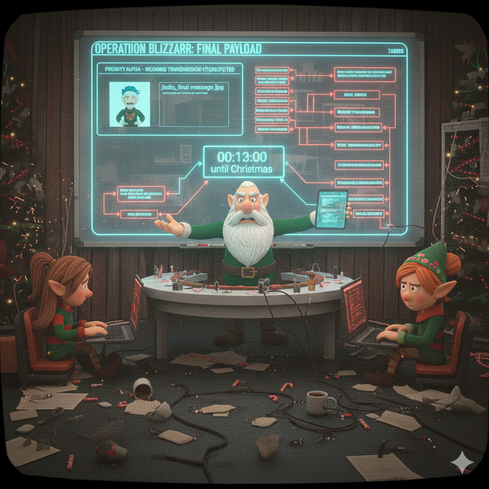

[← Previous Day](../day12/README.md) | [Main README](../README.md) | **Day 13 - BONUS**

---

# Day 13 (December 24) - Operation Blizzard: The Final Payload

## The Story

**December 24, 2024 - 11:47 PM (North Pole Time)**

*Christmas Eve. Thirteen minutes until midnight.*

The North Pole Security Operations Center is quiet. After twelve grueling days of thwarting Jack Frost's attacks, the team has earned a moment of peace. The Nice List database is secure. The gift tracking systems are operational. Santa's sleigh is loaded and ready.

Dekker Frostbeard leans back in his chair, allowing himself a rare smile. They did it. They stopped every attack, decoded every message, cracked every password, and traced every malicious payload. Christmas is saved.

Then his console beeps.

**PRIORITY ALPHA - INCOMING TRANSMISSION INTERCEPTED**

Dekker's blood runs cold as he reads the alert. The email gateway has flagged one final message, sent at 11:45 PM to an unknown recipient list. The sender: `jackfrost@operation-blizzard.net`.

"Everyone, stations NOW!" Dekker's voice cuts through the celebration.

Merry Tinselcode is the first to reach her terminal. "It's an image file. `jacks_final_message.jpg`. Looks like some kind of operational briefing graphic."

Tom Icicle pulls up the metadata. "Sent from one of Jack's backup C2 servers. This wasn't scheduled—this is a last-ditch effort. Something he's had planned all along."

Sarah Hollycode examines the file. "The image size doesn't match the visual content. There's definitely something hidden inside. This is steganography—he's embedded data within the image."

"Can you extract it?" Dekker asks.

"I can try, but it's password protected. We'll need to crack it." Sarah's fingers fly across her keyboard. "And knowing Jack, whatever's inside won't be easy to decode. He's throwing everything at us."

Aisha Frostwhisper pulls up threat intelligence. "If this is Operation Blizzard—his endgame—we need to assume he's used every trick we've seen over the past twelve days. Encoding, encryption, obfuscation, everything."

Dekker checks the clock. Eleven minutes until midnight. Eleven minutes until Christmas officially begins.

"This is it," he says quietly. "Twelve days of attacks were just the prelude. This is his real play—a final payload designed to be so complex, so layered, that we wouldn't have time to crack it before Christmas."

Tom cracks his knuckles. "Then let's prove him wrong. We've beaten everything he's thrown at us. This is just one more puzzle."

"Except we don't have twelve days this time," Merry adds grimly. "We have minutes."

Dekker turns to face his team—the elves who have worked tirelessly to protect Christmas. "Everything you've learned over the past twelve days has led to this moment. The encoding from Day 1. The hash cracking from Day 2. The deobfuscation, the analysis, the forensics—all of it. Jack Frost thinks he's created an unbreakable puzzle. Let's show him what the North Pole SOC team can do."

Outside, snow falls gently on the workshop rooftops. Inside the SOC, the final battle begins.

---

## Your Mission

**You are the North Pole SOC team.**

Jack Frost has sent one final encrypted transmission. Your mission is to extract, decode, decrypt, and analyze the hidden payload to uncover his ultimate plan.

**This challenge uses skills from ALL previous days.** There are no new tools to learn. Everything you need, you already know.

**Starting Artifact:** `jacks_final_message.jpg`

That's all you get. Figure out the rest.

---

## Challenge Information

**Difficulty:** EXPERT

**Layers:** Multiple (you'll discover how many)

**Time Estimate:** 2-4 hours

**Skills Required:** Everything you've learned in Days 1-12

**Tools You May Need:**
- Tools from Day 1 (encoding/decoding)
- Tools from Day 2 (hash cracking)
- Tools from Days 4-5 (script deobfuscation)
- Tools from Day 7 (specialized encoding)
- Tools from Day 8 (database analysis)
- Tools from Day 11 (steganography)
- Your brain

---

## Hints

Only use these if you're truly stuck. The challenge is designed to be solved with the skills you've already learned.

Hint 1: Getting Started

The image contains hidden data. You've done this before—which day taught you how to extract hidden content from images?

The password follows a pattern you've seen before. Think about where this story takes place, and what year it is.

Hint 2: After Extraction

What you extract will contain instructions and encoded data. Read everything carefully.

There's a hash that needs cracking, and an archive that needs a password. The skills from Day 2 and Day 5 will be useful here.

Hint 3: The Script

When you encounter obfuscated code, remember: J = 0x4A in hexadecimal. XOR is reversible.

Hint 4: The Encoded File

Multiple layers of encoding. Start with the outermost layer (what does the data look like?) and work inward.

Hex → Base64 → Binary. You've decoded Base64 before.

Hint 5: The Database

SQL queries reveal secrets. Look for tables that don't seem to belong with the others.

The data you find will need yet another decoding step—one you learned on Day 7.

Hint 6: The Final Layers

JavaScript deobfuscation works the same way it did on Day 4. Multiple parts, multiple techniques.

The very last step uses a cipher named after a Roman emperor. ROT13.

---

## Victory Condition

When you successfully navigate all layers of Jack Frost's final payload, you will find a message containing the flag in `FROST{...}` format.

This flag proves you have mastered the skills of a SOC Analyst and successfully defended Christmas.

---

## Claim Your Reward

Once you've captured the Day 13 flag, use it to unlock your rewards:

1. Navigate to `../challenge_complete/`
2. Extract `challenge_complete.7z` using your Day 13 flag as the password
3. Inside you'll find your Certificate of Achievement and more!

**You've earned it. Go claim your prize!**

---

## A Note From the Creator

If you've made it this far—if you've completed all twelve days and are now attempting the final challenge—congratulations. You've learned real cybersecurity skills:

- Data encoding and decoding
- Password hash cracking
- Brute force attack detection
- Phishing analysis
- Malware deobfuscation
- Web reconnaissance
- Network forensics
- SQL injection
- API security
- Persistence mechanisms
- Steganography
- PDF malware analysis

These aren't just CTF tricks. These are the same techniques used by security professionals around the world every day. You now have a foundation in incident response, digital forensics, and security analysis.

Whatever flag you find at the end of this challenge—you've earned it.

Good luck, and Merry Christmas.

*— VenomousViper (Jeremy Tarkington)*

---

**Flag Format:** `FROST{...}`

---

[← Previous Day](../day12/README.md) | [Main README](../README.md) | **Day 13 - BONUS**
